# System Architecture — Drone Food

> **Version:** 1.1 · **Updated:** 2026-08-30 · **Branch:** `sub-main`
> This document describes the system **as the code actually is**, not as it was hoped to be.
> Vietnamese edition: [`ARCHITECTURE.vi.md`](./ARCHITECTURE.vi.md)

## Contents

| # | Section | # | Section |
|---|---|---|---|
| 1 | [Project overview](#1-project-overview) | 15 | [Logging](#15-logging) |
| 2 | [Tech stack](#2-tech-stack) | 16 | [Error handling](#16-error-handling) |
| 3 | [Folder structure](#3-folder-structure) | 17 | [Security](#17-security) |
| 4 | [System architecture](#4-system-architecture) | 18 | [Performance](#18-performance) |
| 5 | [Module breakdown](#5-module-breakdown) | 19 | [Scalability](#19-scalability) |
| 6 | [Request flow](#6-request-flow) | 20 | [Deployment](#20-deployment) |
| 7 | [Authentication](#7-authentication) | 21 | [Testing](#21-testing) |
| 8 | [Authorization](#8-authorization) | 22 | [Coding conventions](#22-coding-conventions) |
| 9 | [Database](#9-database) | 23 | [Design patterns](#23-design-patterns) |
| 10 | [API architecture](#10-api-architecture) | 24 | [Strengths](#24-strengths) |
| 11 | [Business flows](#11-business-flows) | 25 | [Technical debt](#25-technical-debt) |
| 12 | [Dependency graph](#12-dependency-graph) | 26 | [Improvement proposal](#26-improvement-proposal) |
| 13 | [External services](#13-external-services) | 27 | [Appendix](#27-appendix) |
| 14 | [Configuration](#14-configuration) | | |

---

## 1. Project overview

**Drone Food** is an online food-ordering platform where the delivery leg is flown by **drones** rather than carried by human couriers.

### The problem
Conventional food delivery depends on a courier fleet: labour costs are high, delivery times swing with traffic, and capacity is hard to scale at peak hours. This system models drone delivery instead — shorter delivery times, no traffic variable, and automated dispatch.

### Users and goals

| Role | App | Primary goal |
|---|---|---|
| **Customer** (`user`) | `user/` — port 5173 | Find nearby restaurants, order, track the drone, scan a QR to collect |
| **Restaurant owner** (`restaurant_owner`) | `restaurant/` — port 5175 | Manage the menu, accept and progress orders, open/close for trade |
| **Administrator** (`admin`) | `admin/` — port 5174 | Approve restaurants, manage users, dispatch drones, read the audit trail |

### Defining behaviours
- **Radius-based delivery:** customers only see restaurants within **15 km**, sorted nearest first, each showing real distance and an estimated delivery time.
- **Precise location:** the customer picks the exact drop-off on a map (Geolocation API + TrackAsia); those coordinates are stored on the order so the drone flies to that point.
- **QR collection:** every order gets a QR code; the customer scans it to open the drone's cargo bay.
- **Audit trail:** every privileged action is recorded — who, what, when, and why.

---

## 2. Tech stack

> ⚠️ **Do not introduce new technology** outside this list without approval.

### Backend

| Concern | Technology | Version |
|---|---|---|
| Runtime | Node.js (ES Modules, `"type": "module"`) | 20.x |
| Web framework | Express | ^4.19.2 |
| Database | MongoDB + Mongoose ODM | mongoose ^8.18.3 |
| Auth | jsonwebtoken | ^9.0.2 |
| Password hashing | bcrypt | ^5.1.1 |
| Validation | Joi | ^18.2.3 |
| Realtime | Socket.io | ^4.8.1 |
| Image upload | Multer + Cloudinary | ^1.4.5-lts.1 / ^2.8.0 |
| Payments | Stripe, PayPal SDK | ^15.8.0 / ^1.0.3 |
| Email | Nodemailer | ^9.0.3 |
| HTTP logging | Morgan | ^1.11.0 |
| Rate limiting | express-rate-limit | ^8.6.0 |
| CORS | cors | ^2.8.5 |
| Testing | Vitest + Supertest + mongodb-memory-server | ^4.1.10 / ^7.2.2 / ^11.2.0 |

### Frontend (shared across all three apps)

| Concern | Technology | Version |
|---|---|---|
| UI library | React | ^18.2.0 |
| Build tool | Vite | ^5.2.0 |
| Routing | react-router-dom | ^6.23.1 – ^6.30.1 |
| HTTP client | Axios | ^1.7.2 |
| Toasts | react-toastify | ^11.0.5 |
| Icons | lucide-react | ^1.25.0 |
| Maps | Leaflet + react-leaflet, TrackAsia GL | ^1.9.4 / ^4.2.1 |
| QR | qrcode.react, html5-qrcode | ^4.2.0 / ^2.3.8 |
| Payments | @paypal/react-paypal-js | ^8.9.2 |

### Infrastructure
- **Docker + Docker Compose** — four services (backend, user, admin, restaurant)
- **Nginx** — serves the three static frontend builds inside their containers
- **MongoDB** — runs outside the compose file, reached via `MONGODB_URI`

### ❌ Deliberately NOT used
- **framer-motion** — incompatible with React 18 here (v12 needs React 19; v11 threw "Invalid hook call"). Motion is plain CSS.
- **Redux / Zustand** — React Context is sufficient at this size.
- **TypeScript** — the project is plain JavaScript.
- **Message queue / cache (Redis)** — not needed at current scale.

---

## 3. Folder structure

```
CNPM/
├── backend/                 Express API (Node.js, ES Modules)
│   ├── server.js            Entry point: HTTP server, Socket.io, Cloudinary
│   ├── app.js               Express app (middleware, routes) — split out for testing
│   ├── config/              db.js, cloudinary.js, multer.js, fees.js
│   ├── controllers/         HTTP layer: read req, call service, send res
│   ├── services/            Business logic — every business rule lives here
│   ├── repositories/        Mongoose queries (the only layer touching the DB)
│   ├── models/              Mongoose schemas (`.cjs`)
│   ├── routes/              Endpoint declarations + middleware wiring
│   ├── validations/         Joi schemas, one per route
│   ├── middleware/          auth.js (protect/optionalAuth/authorize), validate.js
│   ├── utils/               AppError, auditLog, geocode, sendEmail, foodOptions
│   ├── seeds/               Seed and backfill scripts
│   └── tests/               unit/ · integration/ · flows/
│
├── user/                    React app — customer
│   └── src/
│       ├── pages/           One folder per route (Home, Cart, Checkout…)
│       ├── components/      Reusable components (folder + matching CSS each)
│       ├── context/         StoreContext — global state
│       ├── hooks/           useGeolocation, useNearbyRestaurants
│       ├── lib/             distance.js, trackasia.js — pure functions, no UI
│       └── assets/
│
├── restaurant/              React app — restaurant owner (same shape)
├── admin/                   React app — administrator (same shape)
├── shared/                  Shared by all three frontends
│   ├── tokens.css           Design tokens (colour, type, spacing)
│   └── components/          OptionGroupBuilder, StateBlock
├── docs/                    Documentation (this file)
└── docker-compose.yml
```

### Naming rules

| Kind | Rule | Example |
|---|---|---|
| Model | `<name>Model.cjs` (CommonJS) | `orderModel.cjs` |
| Service/Controller/Repo | `<name>Service.js`, `<name>Controller.js`, `<name>Repository.js` | `orderService.js` |
| Route | `<name>Route.js` | `orderRoute.js` |
| Validation | `<name>Validation.js` | `orderValidation.js` |
| React component | PascalCase, one folder with `.jsx` + `.css` of the same name | `FoodItem/FoodItem.jsx` |
| Hook | `use<Name>.js` | `useGeolocation.js` |
| CSS class | kebab-case, **prefixed per page** | `.audit-page`, `.restaurants-list` |

> ⚠️ **CSS is bundled globally at build time.** Two pages sharing a class name will overwrite each other — this actually happened between `ListUsers` and `ListRestaurant`. **Always scope classes to their page.**

### Where does new code go?
- New business rule → `services/`
- New database query → `repositories/` (**never** query directly from a service or controller)
- New endpoint → add to `routes/` + `controllers/` + a Joi schema in `validations/`
- Shared pure function on the frontend → `lib/`
- Reusable React logic → `hooks/`

---

## 4. System architecture

The system is a **multi-frontend monorepo talking to one central API**.

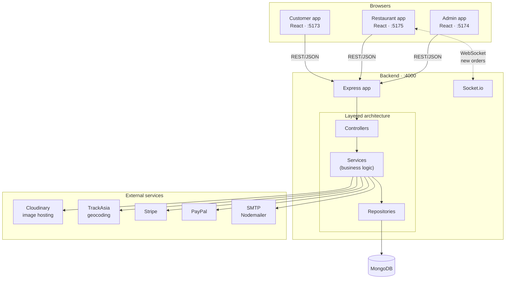

### Data-flow principles
1. **One direction, downward:** Controller → Service → Repository → DB. **No skipping layers** — a controller never calls a repository, a service never calls Mongoose directly.
2. **The server owns money:** prices and totals are **always recomputed from the database**; whatever the client sends is ignored.
3. **Realtime is one-way:** Socket.io only **pushes new-order notifications** to the `restaurant_<id>` room. Every data change still goes through REST.

---

## 5. Module breakdown

| Module | Responsibility | Depends on |
|---|---|---|
| **user** | Registration/login, profile, address, account locking, admin user management | restaurantRepo (owner signup), geocode, auditLog |
| **restaurant** | Restaurant CRUD, approval (`isLocked`), trading switch (`isOpen`) | userRepo, geocode, cloudinary, auditLog |
| **food** | Dish CRUD, option groups | foodRepo, cloudinary |
| **cart** | Server-side cart, one-restaurant-per-cart rule | cartRepo, foodRepo |
| **order** | Placing orders, status transitions, revenue split | cartRepo, restaurantRepo, userRepo, droneRepo, stripe, auditLog |
| **drone** | Drone assignment/reassignment, QR, cargo bay, flight history | orderRepo, restaurantRepo, droneRepo, auditLog |
| **audit** | Writing and reading the privileged-action trail | AuditLog model |
| **config** | Serves delivery/service fees and the PayPal client id | fees.js |

### Public interface
Each module is reached through its **service** (called by a controller). Repositories are **internal**; cross-module repository imports are limited to the exceptions listed above.

---

## 6. Request flow

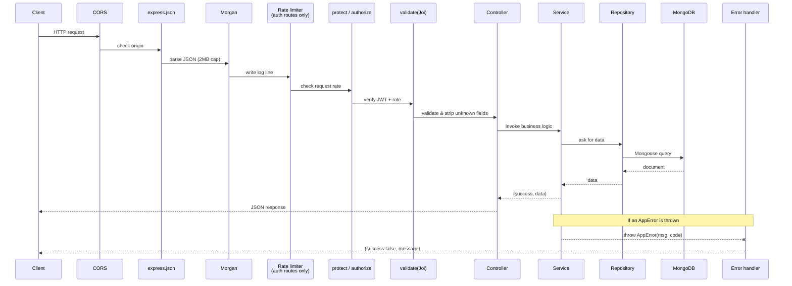

### Middleware order (declared in `app.js`)
1. `cors` — only origins listed in `ALLOWED_ORIGINS`
2. `express.json({ limit: "2mb" })`
3. `morgan` — skipped when `NODE_ENV=test`
4. `/images` — static files from `uploads/`
5. Routers by prefix (`/api/food`, `/api/user`, …)
6. `/api/health` — returns 503 when the database is unreachable
7. **Centralised error handler**
8. **404 handler** (always last)

> `cleanOrderPayload` is a route-specific middleware mounted only on `/api/order`; it normalises `restaurantId` when an older client sends it as an object.

---

## 7. Authentication

### Mechanism: **JWT with two token types**

| Token | Lifetime | Payload | Stored |
|---|---|---|---|
| **Access token** | **30 minutes** | `{ id, type: "access" }` | `localStorage` (key `token`) |
| **Refresh token** | **7 days** | `{ id, type: "refresh" }` | `localStorage` + **SHA-256 hash in the DB** |

The refresh token is **never stored raw** — only its SHA-256 hash (`user.refreshToken`, marked `select: false`).

### Registration flow
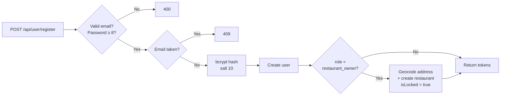

### Login flow
1. Look up by email → missing: **401**
2. `user.locked` → **403**
3. `bcrypt.compare` fails → **401**
4. For owners: restaurant missing → **404**; `isLocked = true` → **403** (awaiting approval)
5. Issue access + refresh tokens, store the hashed refresh token

### Password reset
`POST /forgot-password` generates a random token, stores `resetPasswordToken` + `resetPasswordExpires` and emails it via Nodemailer → `POST /reset-password` sets the new password. **Both endpoints are rate-limited.**

> ⚠️ **No 2FA yet.** Tracked under [Improvement proposal](#26-improvement-proposal).

### The `protect` middleware
Reads the token from `Authorization: Bearer <token>` **or** a `token` header (backward compatibility), verifies it, **refuses a refresh token used for authentication**, loads the user into `req.user`, and blocks locked accounts and owners whose restaurant is not yet approved.

---

## 8. Authorization

### Model: **RBAC + ownership checks in the service layer**

Three roles, defined on `userModel.role`:
```
"user" | "restaurant_owner" | "admin"
```

### Two layers of control

**Layer 1 — the `authorize(...roles)` middleware:** blocks by role at the route.
```js
router.get("/list", protect, authorize("admin"), listUsers);
```

**Layer 2 — ownership checks inside services:** the right role is **not enough** — it must be the right *owner of that resource*.
```js
// An owner may only edit their own restaurant
if (user.role !== "admin") {
  const ownsViaRestaurant = String(existing.owner?._id || existing.owner) === String(user._id);
  const ownsViaUser = String(user.restaurantId || "") === String(id);
  if (!ownsViaRestaurant && !ownsViaUser) throw new AppError("...", 403);
}
```

> ⚠️ **Hard-won lesson:** a real vulnerability came from writing `if (user.role === "restaurant_owner" && notOwner) throw` — a plain customer **sailed straight through** because the role never matched. The correct shape is **`if (user.role !== "admin" && notOwner) throw`**: deny by default, exempt only admins.

### Permission matrix

| Action | user | restaurant_owner | admin |
|---|:---:|:---:|:---:|
| Browse restaurants / dishes | ✅ | ✅ | ✅ |
| Place an order | ✅ | – | – |
| Cancel own order (while `pending`) | ✅ | – | – |
| Confirm receipt | ✅ | – | – |
| Dish CRUD | ❌ | ✅ (own restaurant) | ✅ |
| Edit restaurant details | ❌ | ✅ (own restaurant) | ✅ |
| Open/close for trade | ❌ | ✅ (own restaurant) | ✅ |
| Change order status | limited | ✅ (own orders) | ✅ **reason required** |
| Approve / lock a restaurant | ❌ | ❌ | ✅ |
| Lock a user | ❌ | ❌ | ✅ |
| **Set another user's password** | ❌ | ❌ | ❌ **forbidden outright** |
| Assign / change drone | ❌ | automatic on handover | ✅ |
| Read the audit trail | ❌ | ❌ | ✅ |

> ⚠️ **Do not invent new roles** without approval. A new role means touching the `userModel` enum, every `authorize(...)` call, and this whole matrix.

---

## 9. Database

**MongoDB** (NoSQL, document store) through the Mongoose ODM.

### Entity relationships

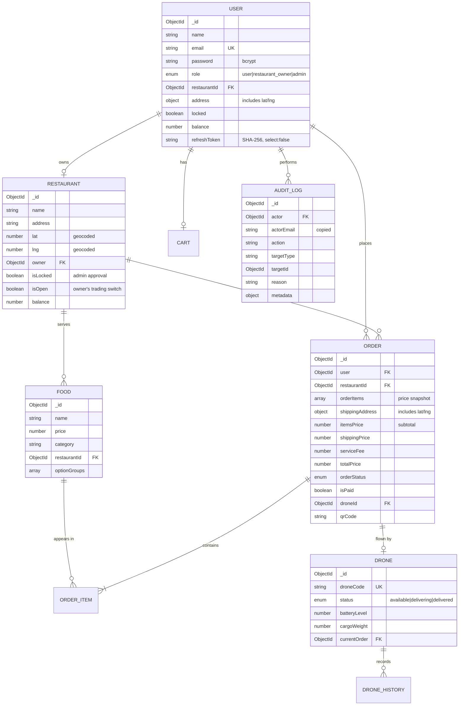

### Key design decisions

**1. Price snapshots in `orderItems`.** Each order line stores `name`, `price`, `image` and `selectedOptions` **as they were at order time**. A later price change **never rewrites history**.

**2. `itemsPrice` is separate from `totalPrice`.** `totalPrice` already includes delivery and service fees. The revenue split must use `itemsPrice`, otherwise the restaurant is paid a cut of the delivery fee too.

**3. Two restaurant flags that must not be confused:**
- `isLocked` — **admin approval**. When set, the owner **cannot even log in**.
- `isOpen` — the **owner's own switch**. When off, the restaurant is hidden from customers and refuses orders, but **the owner keeps full access**.

**4. The audit trail is append-only.** `auditLogSchema` uses `timestamps: { createdAt: true, updatedAt: false }` and there is **no update or delete endpoint**.

### Indexes

| Collection | Index | Purpose |
|---|---|---|
| `users` | `email` (unique) | Login, uniqueness |
| `restaurants` | `email` (unique) | Uniqueness |
| `drones` | `droneCode` (unique) | Identity |
| `auditlogs` | `action`, `createdAt: -1`, `(targetType, targetId)` | Filtering and paging the trail |

### Migrations & transactions
- **No migration tool** (Prisma/TypeORM etc.). Schema changes are handled by **scripts in `seeds/`** — for example `backfillRestaurantCoords.js`, which geocoded restaurants created before coordinates existed.
- **Transactions** are used only for the revenue split (`mongoose.startSession` + `withTransaction`), **with a fallback** to sequential writes when MongoDB is not running as a replica set (transactions require one).
- **Connection pool:** Mongoose defaults (10 connections); not tuned.
- **Backups:** ⚠️ **no automated backup policy** — see [Technical debt](#25-technical-debt).

---

## 10. API architecture

**Style:** RESTful, JSON. **No versioning yet** — everything sits under `/api/<resource>`.

### Uniform response shape

Success:
```json
{ "success": true, "data": { }, "message": "..." }
```
Paginated list:
```json
{ "success": true, "data": [ ], "pagination": { "page": 1, "limit": 25, "total": 103, "totalPages": 5 } }
```
Error:
```json
{ "success": false, "message": "What went wrong" }
```

### Status codes in use

| Code | Used for |
|---|---|
| **200** | Success |
| **201** | Created (`POST /api/restaurant`) |
| **400** | Validation failure, missing mandatory reason, illegal status transition |
| **401** | Not logged in / invalid / expired token |
| **403** | Logged in but not permitted; locked account |
| **404** | Resource not found |
| **409** | Conflict: duplicate email, restaurant closed, no drone available |
| **429** | Rate limit exceeded |
| **500** | Unexpected server error |
| **503** | `/api/health` when the database is unreachable |

### Endpoint inventory

| Group | Endpoint | Access |
|---|---|---|
| **user** | `POST /register`, `/login`, `/logout`, `/forgot-password`, `/reset-password`, `/refresh-token` | Public (rate-limited) |
| | `GET /me`, `PUT /update-address`, `/profile`, `/change-password`, `/avatar` | Authenticated |
| | `GET /list`, `/stats`, `POST /lock`, `PUT /update-by-admin`, `DELETE /delete` | admin |
| **restaurant** | `GET /list` | Public (optionalAuth) |
| | `GET /:id`, `PUT /:id`, `POST /` | Authenticated / owner |
| | `PATCH /:id/open-state` | owner, admin |
| | `PUT /:id/lock`, `DELETE /` | admin |
| **food** | `GET /list`, `GET /:id` | Public |
| | `POST /add`, `/remove`, `/update` | owner (own dishes), admin |
| **cart** | `GET /get`, `POST /add`, `/update-line`, `/remove-line`, `/clear` | Authenticated (`router.use(protect)`) |
| **order** | `POST /place`, `/verify`, `GET /userorders` | Authenticated |
| | `GET /list`, `POST /status` | Role-dependent |
| | `GET /status-stats` | admin |
| **drone** | `GET /addresses/:orderId` | Order's customer / its restaurant / admin |
| | `POST /scan-qr`, `/confirm-delivery` | The order's customer |
| | `POST /assign` | admin, owner |
| | `POST /reassign` | admin |
| | `GET /`, `/:id`, `POST /create`, `PUT /:id`, `DELETE /:id`, `/cargo-weight`, `/history/*` | admin |
| **audit** | `GET /` | admin |
| **config** | `GET /fees`, `/paypal` | Public |
| **health** | `GET /api/health` | Public |

### Conventions
- Resources are **singular nouns** (`/api/order`, `/api/restaurant`) — slightly off the usual REST convention of plurals, but **consistent everywhere**; don't change it piecemeal.
- **Every writing route must have a Joi schema.** The `validate` middleware uses `stripUnknown: true`, so unknown fields are **silently dropped**, which closes off mass-assignment attacks.
- Sensitive fields (`password` in `updateByAdminSchema`) are marked `Joi.any().forbidden()` so they **fail loudly** rather than being silently ignored.

---

## 11. Business flows

### 11.1 Order lifecycle

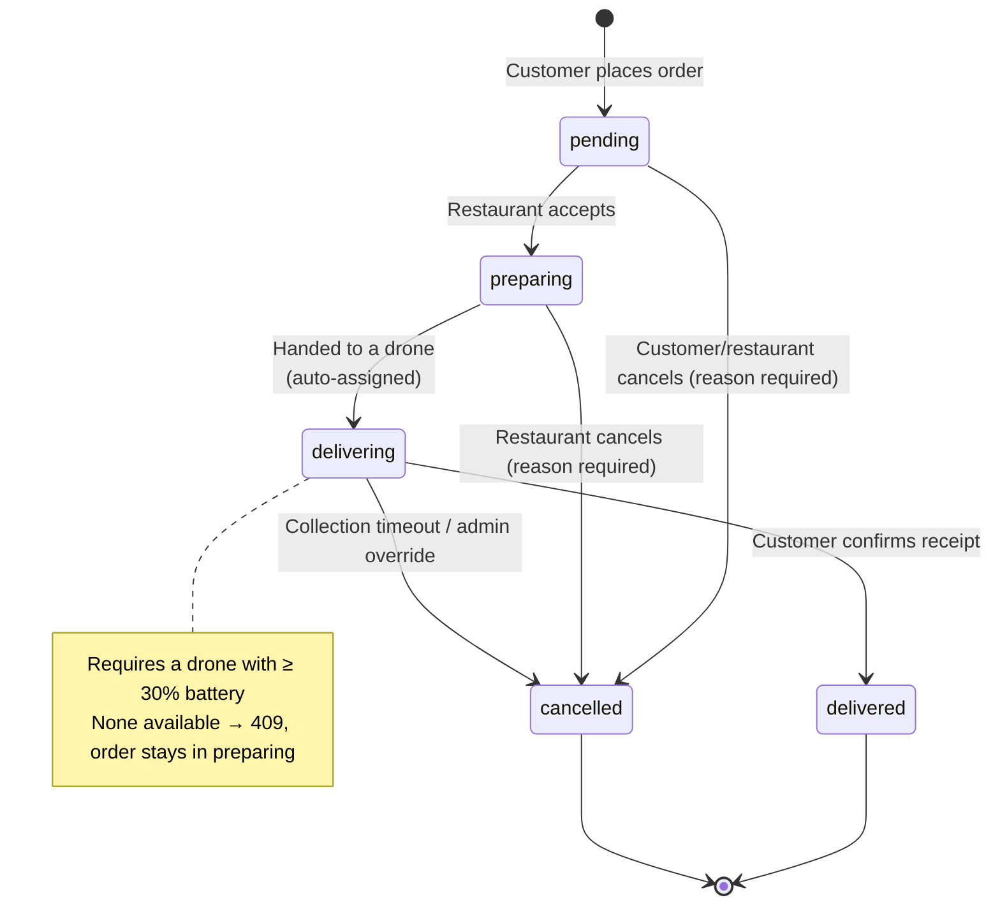

**Who may make which transition:**

| From → To | user | restaurant_owner | admin |
|---|:---:|:---:|:---:|
| pending → preparing | ❌ | ✅ | ✅ (+ reason) |
| preparing → delivering | ❌ | ✅ | ✅ (+ reason) |
| delivering → delivered | ✅ (own order) | ❌ | ✅ (+ reason) |
| * → cancelled | ✅ only while `pending`, + reason | ✅ + reason | ✅ + reason |

### 11.2 Placing an order

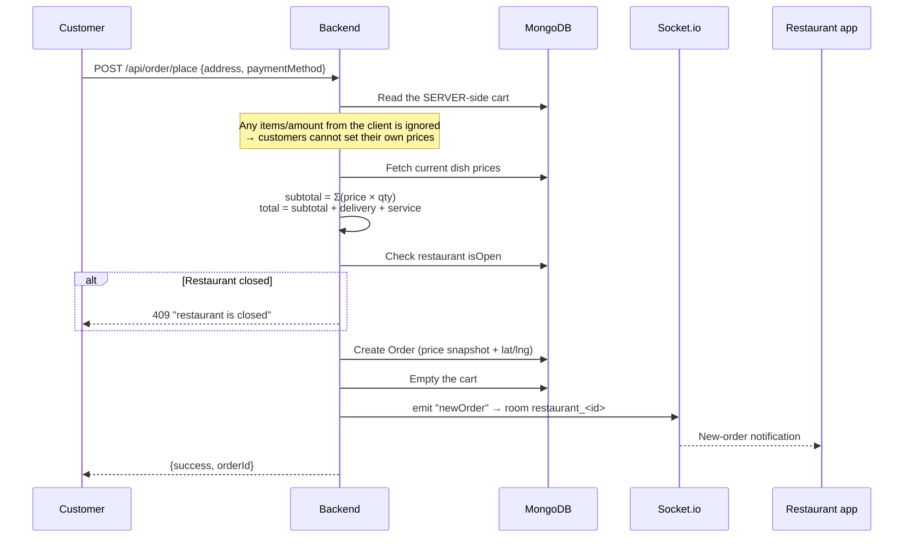

### 11.3 Drone delivery

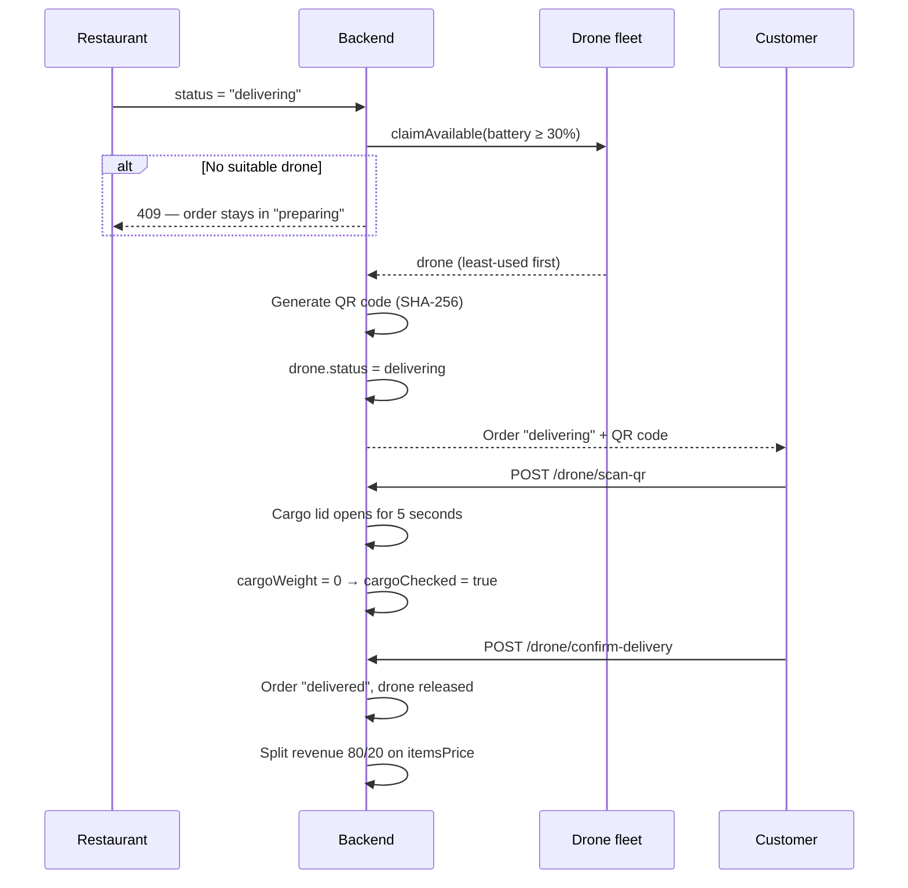

### 11.4 Revenue split

Triggered when an order reaches `delivered` and is paid:

```
itemsSubtotal  = order.itemsPrice   (recomputed from orderItems for older orders)
platformFees   = shippingPrice + serviceFee

restaurant gets = itemsSubtotal × 80%
admin gets      = itemsSubtotal × 20% + platformFees
```
> Delivery fees belong **entirely to the platform** and are never shared with the restaurant.

### 11.5 Restaurant signup and approval

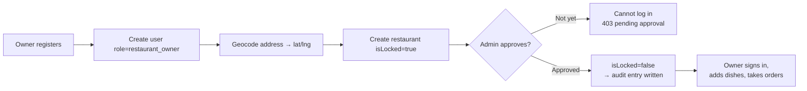

---

## 12. Dependency graph

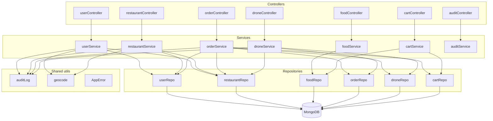

### Dependency rules
1. **One direction:** Controller → Service → Repository. Never the reverse.
2. **No cycles between services.** `orderService` reaches several repositories but **calls no other service**.
3. **Utils depend on nothing** — they take arguments and return results (`auditLog` is the exception; it writes to the DB).
4. **Dynamic imports** are used in two places to avoid cycles: `orderService` imports `droneRepository` and `models/index.cjs` via `await import()`.

### Blast radius

| Change here | Affects |
|---|---|
| `models/*.cjs` | Every repository and service using that model |
| `middleware/auth.js` | **Every route** with `protect` |
| `config/fees.js` | Order placement and price display in all three frontends |
| `shared/tokens.css` | **The look of all three apps** |
| `utils/auditLog.js` | 8 logging call sites across user/restaurant/order/drone services |

---

## 13. External services

| Service | Used for | Configuration | On failure |
|---|---|---|---|
| **Cloudinary** | Dish, restaurant and avatar images | `CLOUDINARY_CLOUD_NAME/API_KEY/API_SECRET` | Throws → request fails |
| **TrackAsia** | Geocoding (coords ↔ address) | `TRACKASIA_KEY` (backend), `VITE_TRACKASIA_KEY` (frontend); defaults to `public_key` | **Returns `null`, never blocks** — the restaurant is still created, just without coordinates |
| **Stripe** | Card payments | `STRIPE_SECRET_KEY` | Throws |
| **PayPal** | PayPal payments | `PAYPAL_CLIENT_ID` | Throws |
| **SMTP (Nodemailer)** | Password-reset email | Configured in `utils/sendEmail.js` | Throws |
| **OpenStreetMap tiles** | Leaflet base map | No key needed | Blank map |

### TrackAsia endpoints (verified)
```
GET https://maps.track-asia.com/api/v2/geocode/json?latlng={lat},{lng}&key={KEY}&new_admin=true
GET https://maps.track-asia.com/api/v2/place/autocomplete/json?input={q}&key={KEY}
```
Responses are **Google-Maps-compatible**. `public_key` is for development only and is rate-limited.

### Failure strategy
Only **geocoding** is designed to fail softly (`utils/geocode.js` swallows every error and returns `null`, with an 8-second timeout). The reasoning: an address without coordinates merely keeps the restaurant out of the nearby list — acceptable; blocking a signup because a map API hiccuped is not.

The other integrations have **no retry or circuit breaker** — see [Technical debt](#25-technical-debt).

---

## 14. Configuration

### `backend/.env`

| Variable | Required | Description |
|---|:---:|---|
| `PORT` | – | API port (default 4000) |
| `MONGODB_URI` | ✅ | MongoDB connection string |
| `JWT_SECRET` | ✅ | JWT signing key — **missing means every request 500s** |
| `ALLOWED_ORIGINS` | ✅ | Comma-separated CORS origins |
| `FRONTEND_URL` | ✅ | Used for Stripe callback URLs |
| `CLOUDINARY_*` | ✅ | Three variables for image upload |
| `STRIPE_SECRET_KEY` | ✅ | Card payments |
| `PAYPAL_CLIENT_ID` | ✅ | PayPal payments |
| `TRACKASIA_KEY` | – | Defaults to `public_key` (rate-limited) |
| `NODE_ENV` | – | `test` disables Morgan; `production` switches it to `combined` |

### `<app>/.env` (frontend, `VITE_` prefix)

| Variable | Used by | Description |
|---|---|---|
| `VITE_API_URL` | all three | Backend URL (default `http://localhost:4000`) |
| `VITE_TRACKASIA_KEY` | user | Geocoding key |
| `VITE_MAPBOX_API_KEY` | all three | ⚠️ Declared but **unused** — see Technical debt |

> ⚠️ `VITE_*` variables are **inlined into the bundle** at build time and are therefore **readable by anyone**. Never put a secret there.

### Local vs production

| | Local (dev) | Production (Docker) |
|---|---|---|
| Backend | `npm run dev` (nodemon, auto-reload) | `docker compose up -d --build backend` |
| Frontend | `npm run dev` (Vite, HMR) — ports 5179/5184/5185 | Nginx serving the build — ports 5173/5174/5175 |
| CORS | Dev ports must be added to `ALLOWED_ORIGINS` | Production origins only |

> ⚠️ **Containers do not mount source code.** Editing files on the host has **no effect** on a running container — you must `docker compose up -d --build <service>`. The backend will 404 new routes until it is rebuilt.

---

## 15. Logging

### 15.1 HTTP logs — Morgan
```js
if (process.env.NODE_ENV !== "test") {
  app.use(morgan(process.env.NODE_ENV === "production" ? "combined" : "dev"));
}
```
- `dev` — short and coloured, for development
- `combined` — Apache-style (IP, timestamp, user agent) for production
- **Disabled entirely during tests** so test output stays readable

### 15.2 Error logs
Only **500-class errors** print a stack trace, from the central error handler. 4xx responses are ordinary business outcomes and are not logged.
```js
if (statusCode === 500) console.error("Server error:", err.stack || err);
```

### 15.3 The audit trail — the important one
Unlike the technical logs above, the audit trail is **written to the database** and serves the business.

Written through `utils/auditLog.js`:
```js
await recordAudit({
  actor,                       // req.user
  action: "order.status_overridden_by_admin",
  targetType: "order",
  targetId: orderId,
  reason: "Customer confirmed by phone",
  metadata: { from: "pending", to: "preparing" },
});
```

**Eight call sites:** order status changes, drone reassignment, admin user edits, user lock/unlock, restaurant lock/unlock, restaurant deletion, trading open/close.

**Design rules:**
- `recordAudit` **swallows its own errors** — a failed audit write must **never** break the business action in progress.
- `actorEmail` and `actorRole` are copied at write time, so the trail stays readable even after an account is deleted.
- **Append-only** — there is no update or delete API.

### ⚠️ Non-negotiable
**Never log passwords, JWTs, refresh tokens or API keys.** `refreshToken` on `userModel` is already `select: false` so it cannot leak accidentally.

---

## 16. Error handling

### Exception hierarchy

```
Error (native JS)
└── AppError               ← deliberate, business-level failure
      • statusCode         ← the HTTP code to return
      • isOperational=true ← distinguishes it from a programming bug
```

```js
throw new AppError("This restaurant is currently closed and is not taking orders.", 409);
```

### The central handler (end of `app.js`)

Handled in order, translating technical failures into user-facing messages:

| Error kind | Code | Handling |
|---|---|---|
| Joi (`err.isJoi`) | 400 | Join every validation message |
| `CastError` (bad ObjectId) | 400 | "Invalid ID: ..." |
| `ValidationError` (Mongoose) | 400 | Join per-field messages |
| `code === 11000` (duplicate key) | 409 | "`<field>` already exists" |
| `entity.parse.failed` | 400 | "Invalid JSON" |
| `AppError` | its `statusCode` | Message passed through |
| Anything else | 500 | **Stack printed to console**, generic message returned |

A **404 handler** comes last: `Cannot <METHOD> <path>`.

### Rules for writing error handling
1. **Use `AppError` for business failures** — don't scatter `res.status(...)` through services.
2. **Never leak internals.** A 403 message once exposed `user._id`, `restaurantId` and `owner` — since fixed.
3. **Controllers always `try/catch`** and return `error.statusCode || 500`.
4. **Clean up on failure:** controllers handling uploads must `fs.unlinkSync(req.file.path)` in their `catch`.

---

## 17. Security

### 17.1 CORS
Only origins listed in `ALLOWED_ORIGINS`, with `credentials: true`. Socket.io uses the **same list**.

### 17.2 Rate limiting
`express-rate-limit`: **10 requests / 15 minutes** on the sensitive routes — `register`, `login`, `forgot-password`, `reset-password`, `refresh-token`.

### 17.3 Input validation
Every writing route goes through Joi with `stripUnknown: true`.

**Mass-assignment protection:** fields not declared in the schema are **stripped**. This is why an owner cannot smuggle `isLocked`, `balance` or `owner` into an update to escalate privilege.

### 17.4 NoSQL injection
Mongoose casts to the schema types, and Joi validates before anything reaches the query layer. No query is assembled by string concatenation.

### 17.5 Passwords
- `bcrypt` with salt round **10**
- Minimum **8 characters**
- `password` is **not selected** by default
- **Admins cannot set another user's password** (`Joi.any().forbidden()` plus a service-level guard) — that would be account takeover, not support

### 17.6 Ownership checks (IDOR protection)
Every operation on an owned resource is checked in the **service layer**, not by role alone. See [section 8](#8-authorization).

### 17.7 File uploads
Multer caps uploads at **5 MB**, accepts JPEG/PNG/GIF/WebP only, and checks **both extension and mimetype**.

### 17.8 Personal data
`GET /api/drone/addresses/:orderId` returns the customer's name, address and phone → readable **only by that customer, the restaurant handling the order, or an admin**.

### ⚠️ What is missing

| Gap | Risk |
|---|---|
| **Helmet** (security headers) | No `X-Frame-Options`, `X-Content-Type-Options`, HSTS… |
| **CSRF tokens** | Low risk, since tokens live in `localStorage` rather than cookies |
| **Server-side payment verification** | 🔴 **Critical** — `verifyOrder` trusts a client-supplied `success` flag |
| **HTTPS** | Required in production; the Geolocation API also demands it |
| **2FA** | Not implemented |

---

## 18. Performance

### What exists today
- **Pagination** on list endpoints (`page`/`limit`); the audit log caps at **200 rows per request**.
- **`.lean()`** on read-only queries returns plain objects instead of heavier Mongoose documents.
- **Cloudinary CDN** serves images directly, bypassing the backend.
- **Frontend:** `useMemo` for distance calculations, `IntersectionObserver` for scroll reveals, skeleton loading states.
- **Distance is computed client-side** (Haversine), so it costs no database work.

### ⚠️ Known bottlenecks

**1. N+1 populates.** `orderRepository.findAll` populates `user`, `orderItems.product` and `restaurantId` for **every** order. The admin page currently loads **111 orders at once**, each populated.

**2. No caching.** `GET /api/restaurant/list` and `/api/food/list` are hit constantly by all three apps despite changing rarely.

**3. The frontend loads everything.** `StoreContext` fetches the entire `food_list` and `restaurant_list` on boot and filters client-side. Fine for 5 restaurants, **not for 500**.

**4. Missing indexes on relational fields.** `orders.restaurantId`, `orders.user` and `foods.restaurantId` are the most frequently filtered fields and have no index.

### Reference SLOs (not yet measured)
There is **no APM instrumentation**. Proposed targets: read APIs **p95 < 300 ms**, order placement **p95 < 1 s**, uptime **99%**.

---

## 19. Scalability

### Today: **single instance, cannot scale horizontally**

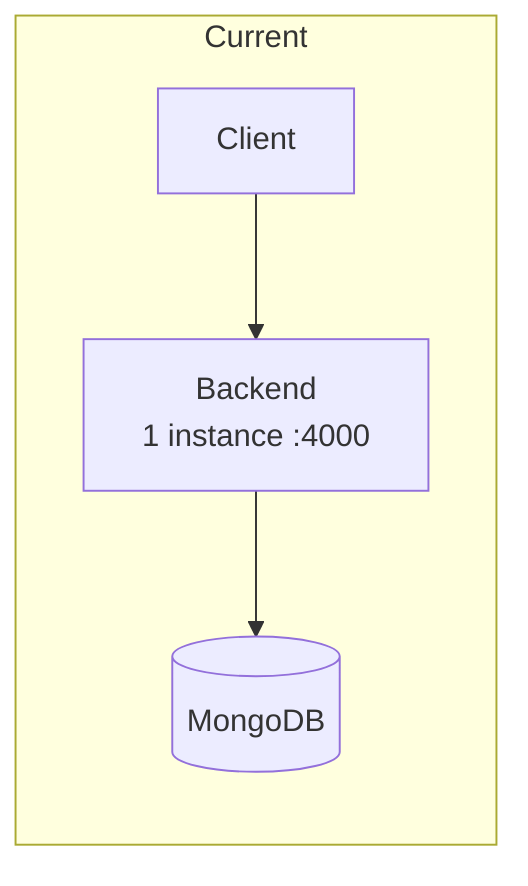

### 🚧 What blocks horizontal scaling

**1. Socket.io has no adapter.** With several instances, an owner connected to instance A **will not receive** a notification emitted from instance B. A **Redis adapter** is required.

**2. In-memory `setTimeout`s.** `droneService.scanQRCode` schedules a 5-second cargo-lid close, and `orderService` a 5-minute collection timeout. **A process restart loses them all.** They belong in a job queue.

**3. Upload staging is on local disk.** `uploads/` is only a staging area before Cloudinary, but separate instances cannot see each other's files if a request is split.

**4. JWT is fine.** Authentication is **stateless**, so that part scales out without change.

### Proposed growth path

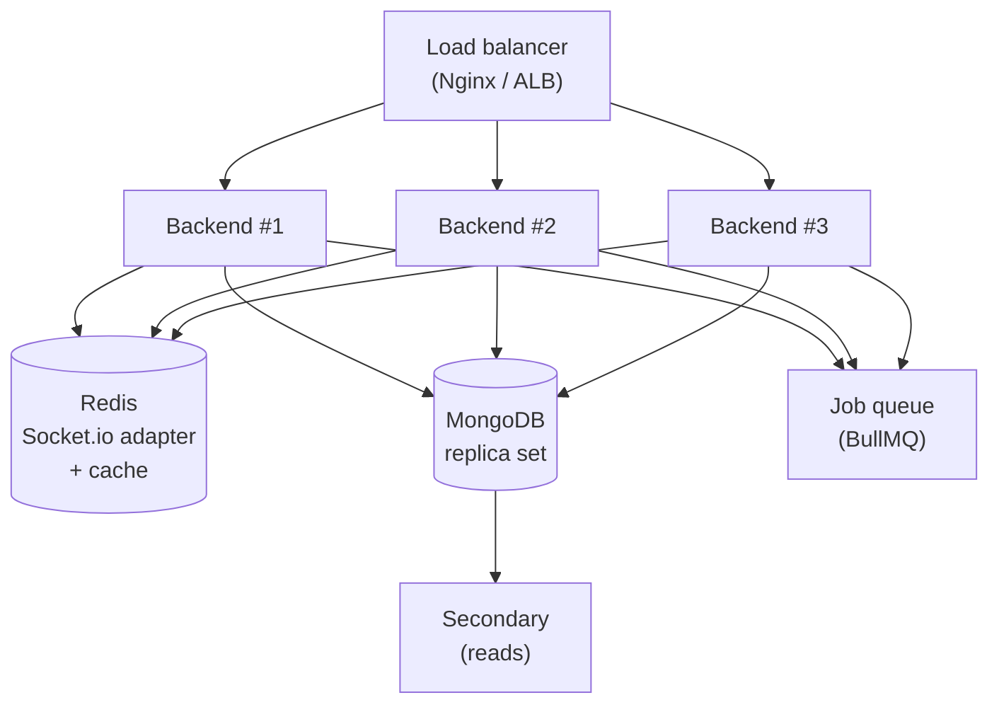

**Order of work when scale is actually needed:**
1. **MongoDB replica set** — enables real transactions and secondary reads
2. **Redis** — Socket.io adapter plus caching of restaurant/dish lists
3. **Job queue** — replace `setTimeout` with durable jobs
4. **Multiple backend instances** behind a load balancer
5. **Sharding** — only at genuinely large scale; if it comes to that, sharding by geographic region fits, since the business is already radius-based

---

## 20. Deployment

### Docker Compose — four services

```yaml
backend    → build ./backend                        → port 4000
user       → build context . / user/Dockerfile      → 5173:80
admin      → build context . / admin/Dockerfile     → 5174:80
restaurant → build context . / restaurant/Dockerfile → 5175:80
```

The three frontends build with the **repository root as context** so they can reach `shared/` (design tokens and shared components).

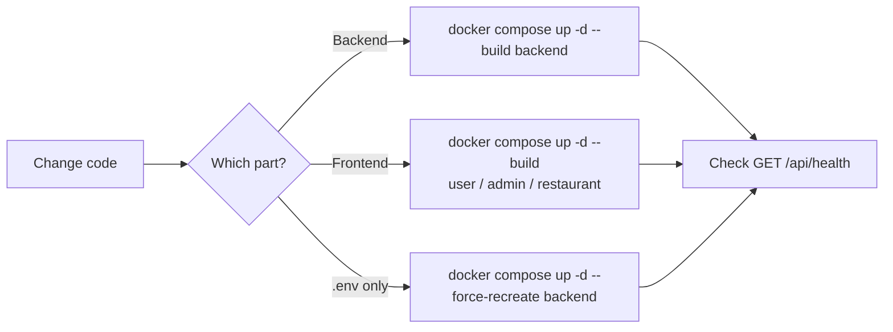

### ⚠️ Deployment facts you must know

**1. Containers do NOT mount source code.** Host edits do not reach a running container; a rebuild is mandatory. The backend will **404 new routes** until then.

**2. `.env` changes need `--force-recreate`.** A plain `docker restart` does **not** reload environment variables.

**3. MongoDB is outside the compose file.** It is reached via `MONGODB_URI` — Atlas or a host-local instance.

### Environments

| Environment | Status |
|---|---|
| **Development** | Vite dev servers (5179/5184/5185) plus the Docker backend or `npm run dev` |
| **Staging** | ❌ Does not exist |
| **Production** | Docker Compose (configured, **no CI/CD**) |

### ⚠️ Not in place
- **CI/CD pipeline** — no GitHub Actions; builds and deploys are manual
- **Blue-green / rolling strategy** — `docker compose up --build` causes brief downtime
- **HTTPS / reverse proxy** at the edge
- **Compose health checks** — even though `/api/health` is ready to be used

---

## 21. Testing

### Tooling
**Vitest** + **Supertest** (HTTP) + **mongodb-memory-server** (a real MongoDB in RAM — no mocking).

### Layout

```
backend/tests/
├── setup.js          Boots the in-memory MongoDB, clears it between tests
├── helpers.js        createAdmin, createRestaurantOwner, generateToken, createOrder
├── unit/             cartService, userService, authMiddleware
├── integration/      auth, cart, order (over real HTTP)
└── flows/            orderFlow — end-to-end business journeys
```

### Current state: **106 tests across 7 files, all passing**

```bash
npm test              # single run
npm run test:watch    # watch mode
npm run test:coverage # coverage report
```

### Three layers

| Layer | What it proves | Example |
|---|---|---|
| **Unit** | Business logic in isolation | `cartService` merges lines when the same dish is added twice |
| **Integration** | HTTP endpoints and permissions | A customer calling an admin API gets 403 |
| **Flow** | Multi-step journeys | Order → accept → dispatch → collect → revenue split |

### Testing principles actually applied here

**1. Tests do not mock the database** — they run a real in-memory MongoDB, so schema mistakes surface too.

**2. When behaviour changes, fix the test to match the correct behaviour — never loosen it to pass.** Two real examples from this codebase:
- A test asserted `balance === totalPrice × 0.8`, which **encoded the bug** of paying restaurants a share of the delivery fee. The test was corrected to the right rule (split on `itemsPrice`).
- The delivery flow tests passed only because **no drone was seeded**, exploiting the hole that let an order reach `delivering` with no drone at all. A **real drone is now seeded** instead of relaxing the check.

**3. Test the refusal path too — and assert nothing changed:**
```js
expect(res.status).toBe(400);
const untouched = await Order.findById(orderId);
expect(untouched.orderStatus).toBe("pending");   // must be untouched
```

### ⚠️ Not covered
- **Frontend tests** (no Vitest/RTL setup for React)
- **Browser E2E** (Playwright/Cypress)
- **Enforced coverage threshold** — the tooling exists, no target is set

---

## 22. Coding conventions

### JavaScript / Node
- **ES Modules** in the backend (`"type": "module"`) — use `import`/`export`.
- **Exception:** models are `.cjs` (CommonJS) because Mongoose behaves more predictably with `require` in this setup. **Do not convert them** without good reason.
- `const` by default, `let` when reassignment is needed, **never `var`**.
- `async/await` — no `.then()` chains.
- Naming: `camelCase` for variables and functions, `PascalCase` for components and classes, `UPPER_SNAKE` for constants.

### Import order (as used throughout)
```js
// 1. Third-party
import express from "express";
// 2. Internal repositories / models
import * as orderRepo from "../repositories/orderRepository.js";
// 3. Utils
import AppError from "../utils/AppError.js";
// 4. Config
import { computeOrderTotals } from "../config/fees.js";
```

### React
- **Function components with hooks** (no classes).
- One folder per component: `Component/Component.jsx` + `Component.css`.
- **CSS classes must be page-prefixed** (`.audit-page`, `.restaurants-list`) because CSS is bundled globally.
- `useMemo` for expensive work (distance maths, list filtering).
- No animation libraries — CSS transitions are enough.

### Comment style
**Comments explain *why*, not *what*.** The code already says what.

```js
// ✅ Good — explains the reason
// createObjectURL in the render body would mint a new blob URL on every
// render and never free any of them. Make one per file and revoke it.

// ❌ Bad — restates the obvious
// Set the preview state
```

### Linting
ESLint is configured for all three frontends (`eslint-plugin-react`, `react-hooks`, `react-refresh`). **The backend has no ESLint setup.**

---

## 23. Design patterns

### 23.1 Layered architecture — the backbone
```
Controller  →   Service   →  Repository  →  Model
  (HTTP)     (business)      (queries)     (schema)
```
Each layer only knows the one below it. **Only repositories touch Mongoose.**

### 23.2 Repository pattern
All queries live in `repositories/`. Services never call `Model.find()` directly.
```js
export const findByOwner = async (ownerId) =>
  await Restaurant.findOne({ owner: ownerId });
```
**Benefits:** swapping the database means rewriting one layer; testing is easier; queries don't sprawl.

### 23.3 Middleware chain (chain of responsibility)
Every request walks a chain, each link doing one job before calling `next()`.
```js
router.put("/:id", protect, authorize("restaurant_owner", "admin"),
           uploadMiddleware.single("image"), validate(updateRestaurantSchema), updateRestaurant);
```

### 23.4 Higher-order functions — `validate` and `authorize`
Functions returning middleware, configurable per route.
```js
const authorize = (...roles) => (req, res, next) => {
  if (!req.user || !roles.includes(req.user.role))
    return res.status(403).json({ success: false, message: "..." });
  next();
};
```

### 23.5 Context provider (frontend)
`StoreContext` (customer) and `AuthContext` (restaurant/admin) supply global state without Redux.

### 23.6 Custom hooks
Reusable logic is packaged as hooks: `useGeolocation`, `useNearbyRestaurants`. That is why the home page and the browse page **share one source of truth** about what counts as nearby.

### 23.7 Optimistic locking via conditional updates
Drone assignment uses `findOneAndUpdate` with the precondition inside the filter, so **two concurrent requests cannot claim the same drone**:
```js
Drone.findOneAndUpdate(
  { _id: droneId, status: "available", batteryLevel: { $gte: 30 } },
  { $set: { status: "delivering", currentOrder: orderId } }
);
```

### ⚠️ Do not introduce new patterns unilaterally
No DI containers, event sourcing or CQRS without agreement. Consistency matters more than novelty.

---

## 24. Strengths

**1. Clean, consistent layering.** All seven modules follow Controller → Service → Repository. Read one module and you understand the whole system.

**2. The server owns money.** Prices and totals are always recomputed from the database; any `items` or `amount` from the client is discarded. Customers **cannot set their own prices**.

**3. Serious testing.** 106 tests against a real in-memory MongoDB, covering unit, integration and flow levels. Notably, tests are **corrected toward the right behaviour** rather than loosened to pass.

**4. Centralised validation with mass-assignment protection.** Joi plus `stripUnknown` discards unknown fields by default, closing an entire class of privilege-escalation bugs.

**5. An audit trail.** Every privileged action is traceable — who, what, when, why — with its own admin screen. Many systems this size have nothing comparable.

**6. A shared design system.** `shared/tokens.css` keeps all three apps visually coherent and makes system-wide dark mode a matter of CSS variables.

**7. The location feature is carried through end to end.** Geolocation API → map picker → coordinates stored on the order → drone flies to that point → restaurants filtered by real distance. No step falls back to fake data.

**8. Centralised error handling.** One handler translates every error kind (Joi, Mongoose, duplicate keys) into a uniform response.

---

## 25. Technical debt

> **Known** problems, ordered by severity. **Don't make them worse.**

### 🔴 Critical

**1. No server-side payment verification.**
```js
// orderService.verifyOrder — the server trusts the client
if (success === true || success === "true") {
  await orderRepo.updateById(orderId, { isPaid: true, paidAt: Date.now() });
}
```
A customer can call the API and mark their own order **paid without paying**. `placeOrder` likewise sets `isPaid = true` merely because the client attached `paymentDetails`.
**Fix:** call `stripe.checkout.sessions.retrieve()` and check `payment_status` server-side; verify PayPal through its capture API; ideally use webhooks.

### 🟠 High

**2. Hard delete for restaurants.** `DELETE /api/restaurant` removes the record permanently. It refuses when orders exist and **is now audit-logged**, but should become a **soft delete**.

**3. Two half-built admin features.** `admin/src/pages/Restaurant/EditRestaurant.jsx` and `pages/Users/EditUser.jsx` are complete components that are **wired to nothing** (the list pages only offer lock/unlock, with no Edit button). `pages/Add/` is likewise unrouted.

**4. Missing indexes on relational fields.** `orders.restaurantId`, `orders.user`, `foods.restaurantId` — the most-filtered fields in the system.

**5. In-memory timeouts.** The cargo-lid and collection timeouts are `setTimeout` calls that **vanish on restart**.

### 🟡 Medium

**6. Fake data presented as real.** A **hardcoded 4.8 rating in five places**; the hero advertises "500+ restaurants" against an actual five. `reviewModel.cjs` exists but **no route or service uses it** — the review system does not exist.

**7. Random `cargoWeight`.** `Math.random() * 1500 + 500`, unrelated to what was ordered.

**8. No caching.** Restaurant and dish lists are requested constantly yet change rarely.

**9. The frontend loads whole collections and filters client-side.** Fine at 5 restaurants, not at 500.

**10. `VITE_MAPBOX_API_KEY` is declared in all three apps but never used** — the maps run on Leaflet + OSM. It should be removed.

**11. No Helmet** (security headers) and **no HTTPS**.

**12. No CI/CD.**

### 🟢 Low

**13. Mixed Vietnamese and English** in backend comments and messages.

**14. No ESLint on the backend.**

**15. Some dead code remains** (`productModel`, `categoryModel` commented out in `models/index.cjs`).

**16. Balances were computed with the old formula.** Orders completed **before 2026-08-19** were split using the incorrect rule (sharing the delivery fee). Existing restaurant and admin balances were **not recalculated**.

---

## 26. Improvement proposal

### Phase 1 — Required before running for real

| # | Work | Why |
|---|---|---|
| 1 | **Server-side payment verification** (Stripe retrieve + webhooks, PayPal capture) | Real money is at risk |
| 2 | **HTTPS + Helmet** | Mandatory in production; Geolocation also requires HTTPS |
| 3 | **Soft-delete restaurants** | Preserve records tied to transactions |
| 4 | **Add indexes** on `orders.restaurantId`, `orders.user`, `foods.restaurantId` | Performance degrades quickly with order volume |

### Phase 2 — Product completeness

| # | Work | Notes |
|---|---|---|
| 5 | **A real review system** | `reviewModel` already exists; replaces the hardcoded 4.8 |
| 6 | **Wire up the two admin modals** | With restricted fields, a mandatory reason, and audit entries |
| 7 | **Remove untrue marketing figures** ("500+ restaurants") | Credibility |
| 8 | **Derive `cargoWeight` from real dishes** | Add a `weight` field to food |
| 9 | **Frontend and E2E tests** | Vitest + RTL, Playwright |

### Phase 3 — Ready to scale

| # | Work | Notes |
|---|---|---|
| 10 | **MongoDB replica set** | Real transactions plus secondary reads |
| 11 | **Redis** | Socket.io adapter and list caching |
| 12 | **Job queue (BullMQ)** | Durable replacements for `setTimeout` |
| 13 | **CI/CD** | GitHub Actions: test → build → deploy |
| 14 | **APM / monitoring** | You cannot optimise what you cannot measure |

### Phase 4 — New capabilities

- **Human couriers (shippers)** — considered and **deliberately deferred**; it needs its own data model, business flows and a fourth app.
- **2FA** for administrator accounts
- **Push notifications** on order status changes
- **API versioning** (`/api/v1/...`) before any third party integrates

### Overall direction
The system is a **well-layered monolith**. **Do not split it into microservices** at this scale — the operational cost outweighs the benefit. The right path is to keep the monolith and add **caching, a queue and replication**, scaling out when demand justifies it.

---

## 27. Appendix

### 27.1 Glossary

| Term | Meaning |
|---|---|
| **Drone** | The unmanned aircraft delivering orders; has a code, battery and cargo bay |
| **Nest** | A drone docking/charging station (industry term; **not modelled in this system**) |
| **Collection QR** | Per-order code the customer scans to open the cargo bay |
| **`isLocked`** | **Admin approval** flag. Set = the owner cannot log in |
| **`isOpen`** | The **owner's trading switch**. Off = hidden from customers, but they can still log in |
| **Audit log** | Append-only record of privileged actions |
| **IDOR** | Accessing someone else's resource by changing an ID |
| **Mass assignment** | Smuggling unexpected fields into a request to modify sensitive data |
| **Haversine** | Formula for distance between two points on a sphere |
| **BVLOS** | Beyond Visual Line Of Sight — a regulated drone operating mode |

### 27.2 System constants

| Constant | Value | Location |
|---|---|---|
| Restaurant search radius | **15 km** | `user/src/lib/distance.js` → `NEARBY_RADIUS_KM` |
| Minimum battery to fly | **30 %** | `backend/repositories/droneRepository.js` → `MIN_BATTERY_PERCENT` |
| Shipper fee | **5,000 VND/km** by road route | `backend/config/fees.js` → `SHIPPER_RATE_PER_KM` |
| Drone fee | **7,000 VND/km** by straight-line distance | `backend/config/fees.js` → `DRONE_RATE_PER_KM` |
| Service fee | **0 VND** | `backend/config/fees.js` → `SERVICE_FEE` |
| Revenue split | **80 / 20** on `itemsPrice` | `backend/services/orderService.js` |
| Access token lifetime | **30 minutes** | `backend/services/userService.js` |
| Refresh token lifetime | **7 days** | `backend/services/userService.js` |
| Auth rate limit | **10 req / 15 min** | `backend/routes/userRoute.js` |
| Upload cap | **5 MB** | `backend/config/multer.js` |
| JSON body cap | **2 MB** | `backend/app.js` |
| ETA estimate | 10 min + 2 min/km | `user/src/lib/distance.js` |

### 27.3 Recorded architecture decisions

| # | Decision | Rationale |
|---|---|---|
| **AD-1** | No framer-motion | Incompatible with React 18 here; motion is plain CSS |
| **AD-2** | Models are `.cjs` inside an ESM project | Mongoose is more predictable with `require` in this setup |
| **AD-3** | Split revenue on `itemsPrice`, not `totalPrice` | Delivery fees belong to the platform, not the restaurant |
| **AD-4** | Separate `isLocked` and `isOpen` | Admin approval and trading state are different concerns; a closed restaurant's owner must still be able to log in |
| **AD-5** | Ownership checks use `role !== "admin"` | Writing `role === "restaurant_owner"` let ordinary customers slip through — this was a real vulnerability |
| **AD-6** | The audit logger swallows its own errors | A failed log write must not break the business action |
| **AD-7** | No suitable drone → refuse the `delivering` transition | Previously the order moved anyway with no drone or QR, stranding it forever |
| **AD-8** | Drone reassignment keeps the QR code | The QR identifies the order, not the aircraft; the customer may already have it open |
| **AD-9** | Geocoding fails soft | Missing coordinates only hide a restaurant from the nearby list; blocking signup over a map API is disproportionate |
| **AD-10** | Human couriers deferred | Needs its own data model, business flows and a fourth app — too large for the value at this stage |
| **AD-11** | No microservices | Operational cost outweighs the benefit at this scale |

### 27.4 Common commands

```bash
# Run everything with Docker
docker compose up -d --build

# Develop one app (code on the host, backend in Docker)
cd backend    && npm run dev
cd user       && npm run dev -- --port 5179 --strictPort
cd admin      && npm run dev -- --port 5184 --strictPort
cd restaurant && npm run dev -- --port 5185 --strictPort

# Tests
cd backend && npm test

# After backend changes (rebuild is MANDATORY)
docker compose up -d --build backend

# After .env changes
docker compose up -d --force-recreate backend

# Health check
curl http://localhost:4000/api/health

# Seeding / backfill
docker exec drone-delivery-backend node seeds/seedDrones.js
docker exec drone-delivery-backend node seeds/backfillRestaurantCoords.js
```

### 27.5 References

- [Express](https://expressjs.com/) · [Mongoose](https://mongoosejs.com/docs/) · [Joi](https://joi.dev/api/)
- [Socket.io](https://socket.io/docs/v4/) · [Vitest](https://vitest.dev/) · [React Router v6](https://reactrouter.com/en/main)
- [TrackAsia Docs](https://docs.track-asia.com/) · [Leaflet](https://leafletjs.com/reference.html)
- [MDN — Geolocation API](https://developer.mozilla.org/en-US/docs/Web/API/Geolocation_API)
- `README.md` — quick setup guide

---

*Keep this document current. If a change you make invalidates something here, fix the document in the same change.*
