# Tài liệu Kiến trúc Hệ thống — Drone Food

> **Phiên bản:** 1.1 · **Cập nhật:** 2026-08-30 · **Nhánh:** `sub-main`
> Tài liệu này mô tả hệ thống **đúng như code hiện tại**, không phải thiết kế mong muốn.
> Bản tiếng Anh: [`ARCHITECTURE.en.md`](./ARCHITECTURE.en.md)

## Mục lục

| # | Phần | # | Phần |
|---|---|---|---|
| 1 | [Tổng quan dự án](#1-tổng-quan-dự-án) | 15 | [Ghi log](#15-ghi-log) |
| 2 | [Công nghệ sử dụng](#2-công-nghệ-sử-dụng) | 16 | [Xử lý lỗi](#16-xử-lý-lỗi) |
| 3 | [Cấu trúc thư mục](#3-cấu-trúc-thư-mục) | 17 | [Bảo mật](#17-bảo-mật) |
| 4 | [Kiến trúc hệ thống](#4-kiến-trúc-hệ-thống) | 18 | [Hiệu suất](#18-hiệu-suất) |
| 5 | [Phân tích module](#5-phân-tích-module) | 19 | [Khả năng mở rộng](#19-khả-năng-mở-rộng) |
| 6 | [Luồng request](#6-luồng-request) | 20 | [Triển khai](#20-triển-khai) |
| 7 | [Xác thực](#7-xác-thực) | 21 | [Kiểm thử](#21-kiểm-thử) |
| 8 | [Phân quyền](#8-phân-quyền) | 22 | [Quy tắc code](#22-quy-tắc-code) |
| 9 | [Cơ sở dữ liệu](#9-cơ-sở-dữ-liệu) | 23 | [Mẫu thiết kế](#23-mẫu-thiết-kế) |
| 10 | [Kiến trúc API](#10-kiến-trúc-api) | 24 | [Điểm mạnh](#24-điểm-mạnh) |
| 11 | [Luồng nghiệp vụ](#11-luồng-nghiệp-vụ) | 25 | [Nợ công nghệ](#25-nợ-công-nghệ) |
| 12 | [Đồ thị phụ thuộc](#12-đồ-thị-phụ-thuộc) | 26 | [Đề xuất cải tiến](#26-đề-xuất-cải-tiến) |
| 13 | [Dịch vụ bên ngoài](#13-dịch-vụ-bên-ngoài) | 27 | [Phụ lục](#27-phụ-lục) |
| 14 | [Cấu hình](#14-cấu-hình) | | |

---

## 1. Tổng quan dự án

**Drone Food** là nền tảng đặt đồ ăn trực tuyến, trong đó khâu giao hàng do **drone (máy bay không người lái)** đảm nhiệm thay vì shipper.

### Bài toán giải quyết
Giao đồ ăn truyền thống phụ thuộc vào đội shipper: chi phí nhân công cao, thời gian giao biến động theo giao thông, và khó mở rộng vào giờ cao điểm. Hệ thống này mô phỏng mô hình giao bằng drone: rút ngắn thời gian giao, loại bỏ yếu tố tắc đường, và tự động hoá khâu điều phối.

### Người dùng và mục tiêu

| Vai trò | App | Mục tiêu chính |
|---|---|---|
| **Khách hàng** (`user`) | `user/` — cổng 5173 | Tìm quán gần, đặt món, theo dõi drone, quét QR nhận hàng |
| **Chủ nhà hàng** (`restaurant_owner`) | `restaurant/` — cổng 5175 | Quản lý thực đơn, nhận & xử lý đơn, bật/tắt trạng thái bán |
| **Quản trị viên** (`admin`) | `admin/` — cổng 5174 | Duyệt nhà hàng, quản lý người dùng, điều phối drone, xem nhật ký |

### Đặc trưng nghiệp vụ
- **Giao hàng theo bán kính:** khách chỉ thấy nhà hàng trong **15 km** quanh vị trí của mình, sắp xếp gần → xa, kèm khoảng cách và thời gian giao ước tính.
- **Vị trí chính xác:** khách chọn điểm giao trên bản đồ (Geolocation API + TrackAsia), toạ độ được lưu vào đơn để drone bay đúng điểm.
- **Nhận hàng bằng QR:** mỗi đơn sinh một mã QR; khách quét mã để mở khoang hàng của drone.
- **Nhật ký kiểm toán:** mọi hành động đặc quyền đều được ghi lại (ai – làm gì – khi nào – lý do).

---

## 2. Công nghệ sử dụng

> ⚠️ **Không tự ý thêm công nghệ mới** ngoài danh sách này khi chưa được phê duyệt.

### Backend

| Thành phần | Công nghệ | Phiên bản |
|---|---|---|
| Runtime | Node.js (ES Modules, `"type": "module"`) | 20.x |
| Web framework | Express | ^4.19.2 |
| CSDL | MongoDB + Mongoose ODM | mongoose ^8.18.3 |
| Xác thực | jsonwebtoken | ^9.0.2 |
| Mã hoá mật khẩu | bcrypt | ^5.1.1 |
| Validation | Joi | ^18.2.3 |
| Realtime | Socket.io | ^4.8.1 |
| Upload ảnh | Multer + Cloudinary | ^1.4.5-lts.1 / ^2.8.0 |
| Thanh toán | Stripe, PayPal SDK | ^15.8.0 / ^1.0.3 |
| Email | Nodemailer | ^9.0.3 |
| HTTP log | Morgan | ^1.11.0 |
| Rate limit | express-rate-limit | ^8.6.0 |
| CORS | cors | ^2.8.5 |
| Kiểm thử | Vitest + Supertest + mongodb-memory-server | ^4.1.10 / ^7.2.2 / ^11.2.0 |

### Frontend (dùng chung cho cả 3 app)

| Thành phần | Công nghệ | Phiên bản |
|---|---|---|
| Thư viện UI | React | ^18.2.0 |
| Build tool | Vite | ^5.2.0 |
| Routing | react-router-dom | ^6.23.1 – ^6.30.1 |
| HTTP client | Axios | ^1.7.2 |
| Thông báo | react-toastify | ^11.0.5 |
| Icon | lucide-react | ^1.25.0 |
| Bản đồ | Leaflet + react-leaflet, TrackAsia GL | ^1.9.4 / ^4.2.1 |
| QR | qrcode.react, html5-qrcode | ^4.2.0 / ^2.3.8 |
| Thanh toán | @paypal/react-paypal-js | ^8.9.2 |

### Hạ tầng
- **Docker + Docker Compose** — 4 service (backend, user, admin, restaurant)
- **Nginx** — phục vụ bản build tĩnh của 3 frontend trong container
- **MongoDB** — chạy ngoài container (kết nối qua `MONGODB_URI`)

### ❌ KHÔNG sử dụng (có chủ đích)
- **framer-motion** — không tương thích React 18 ở dự án này (v12 cần React 19; v11 lỗi "Invalid hook call"). Chuyển động dùng CSS thuần.
- **Redux / Zustand** — state quản lý bằng React Context là đủ với quy mô hiện tại.
- **TypeScript** — dự án dùng JavaScript thuần.
- **Message queue / Cache (Redis)** — chưa cần ở quy mô hiện tại.

---

## 3. Cấu trúc thư mục

```
CNPM/
├── backend/                 API Express (Node.js, ES Modules)
│   ├── server.js            Điểm khởi động: HTTP server, Socket.io, Cloudinary
│   ├── app.js               Express app (middleware, routes) — tách riêng để test
│   ├── config/              db.js, cloudinary.js, multer.js, fees.js
│   ├── controllers/         Tầng HTTP: đọc req, gọi service, trả res
│   ├── services/            Nghiệp vụ — nơi chứa mọi quy tắc kinh doanh
│   ├── repositories/        Truy vấn Mongoose (chỉ tầng này chạm DB)
│   ├── models/              Schema Mongoose (`.cjs`)
│   ├── routes/              Khai báo endpoint + gắn middleware
│   ├── validations/         Schema Joi cho từng route
│   ├── middleware/          auth.js (protect/optionalAuth/authorize), validate.js
│   ├── utils/               AppError, auditLog, geocode, sendEmail, foodOptions
│   ├── seeds/               Script seed & backfill dữ liệu
│   └── tests/               unit/ · integration/ · flows/
│
├── user/                    React app — khách hàng
│   └── src/
│       ├── pages/           Mỗi route một thư mục (Home, Cart, Checkout…)
│       ├── components/      Component tái dùng (mỗi cái 1 thư mục + CSS riêng)
│       ├── context/         StoreContext — state toàn cục
│       ├── hooks/           useGeolocation, useNearbyRestaurants
│       ├── lib/             distance.js, trackasia.js — hàm thuần, không UI
│       └── assets/
│
├── restaurant/              React app — chủ nhà hàng (cấu trúc tương tự)
├── admin/                   React app — quản trị (cấu trúc tương tự)
├── shared/                  Dùng chung cho cả 3 frontend
│   ├── tokens.css           Design token (màu, font, spacing)
│   └── components/          OptionGroupBuilder, StateBlock
├── docs/                    Tài liệu (file này)
└── docker-compose.yml
```

### Quy tắc đặt tên

| Loại | Quy tắc | Ví dụ |
|---|---|---|
| Model | `<tên>Model.cjs` (CommonJS) | `orderModel.cjs` |
| Service/Controller/Repo | `<tên>Service.js`, `<tên>Controller.js`, `<tên>Repository.js` | `orderService.js` |
| Route | `<tên>Route.js` | `orderRoute.js` |
| Validation | `<tên>Validation.js` | `orderValidation.js` |
| Component React | PascalCase, 1 thư mục + `.jsx` + `.css` cùng tên | `FoodItem/FoodItem.jsx` |
| Hook | `use<Tên>.js` | `useGeolocation.js` |
| CSS class | kebab-case, **có tiền tố theo trang** | `.audit-page`, `.restaurants-list` |

> ⚠️ **CSS được gom toàn cục khi build.** Hai trang khác nhau dùng chung tên class sẽ đè lên nhau (lỗi này đã từng xảy ra giữa `ListUsers` và `ListRestaurant`). **Luôn scope class theo trang.**

### Đặt code mới ở đâu?
- Quy tắc nghiệp vụ mới → `services/`
- Truy vấn DB mới → `repositories/` (**không** truy vấn trực tiếp trong service/controller)
- Endpoint mới → thêm ở `routes/` + `controllers/` + schema Joi ở `validations/`
- Hàm thuần dùng chung ở frontend → `lib/`
- Logic React tái dùng → `hooks/`

---

## 4. Kiến trúc hệ thống

Hệ thống theo mô hình **monorepo đa frontend + một API tập trung**.

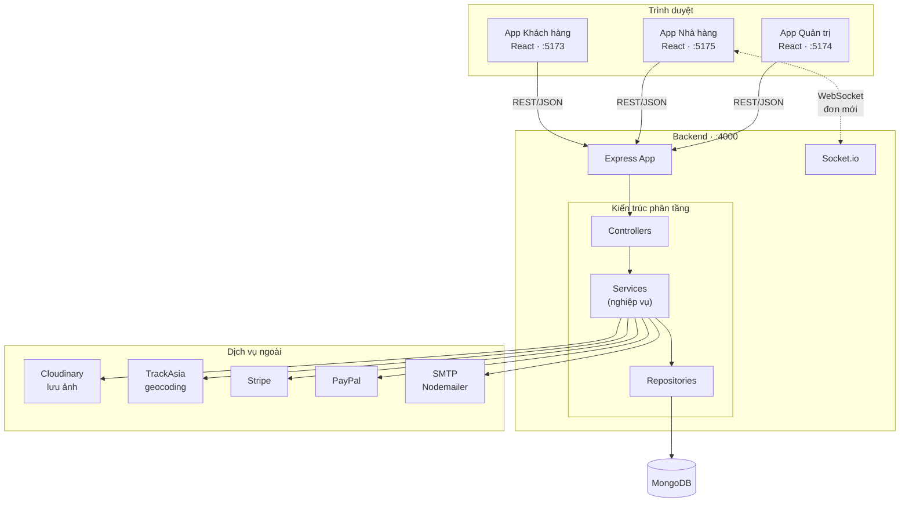

### Nguyên tắc luồng dữ liệu
1. **Một chiều xuống:** Controller → Service → Repository → DB. **Không được nhảy cóc** (controller không gọi thẳng repository, service không gọi thẳng Mongoose).
2. **Server là nguồn sự thật về tiền:** giá và tổng tiền **luôn tính lại từ DB**, không bao giờ tin số liệu client gửi lên.
3. **Realtime một chiều:** Socket.io chỉ dùng để **đẩy thông báo đơn mới** tới phòng `restaurant_<id>`. Mọi thay đổi dữ liệu vẫn đi qua REST.

---

## 5. Phân tích module

| Module | Trách nhiệm | Phụ thuộc |
|---|---|---|
| **user** | Đăng ký/đăng nhập, hồ sơ, địa chỉ, khoá tài khoản, quản trị người dùng | restaurantRepo (khi đăng ký chủ quán), geocode, auditLog |
| **restaurant** | CRUD nhà hàng, duyệt (`isLocked`), đóng/mở bán (`isOpen`) | userRepo, geocode, cloudinary, auditLog |
| **food** | CRUD món ăn, nhóm tuỳ chọn | foodRepo, cloudinary |
| **cart** | Giỏ hàng phía server, ràng buộc 1 nhà hàng/giỏ | cartRepo, foodRepo |
| **order** | Đặt đơn, chuyển trạng thái, chia doanh thu | cartRepo, restaurantRepo, userRepo, droneRepo, stripe, auditLog |
| **drone** | Gán/đổi drone, QR, khoang hàng, lịch sử bay | orderRepo, restaurantRepo, droneRepo, auditLog |
| **audit** | Ghi & đọc nhật ký hành động đặc quyền | AuditLog model |
| **config** | Cung cấp phí giao/dịch vụ, PayPal client id | fees.js |

### Interface công khai của mỗi module
Mỗi module lộ ra ngoài qua **service** (được controller gọi). Repository là **nội bộ**, không được import xuyên module tuỳ tiện — ngoại lệ được liệt kê ở cột "Phụ thuộc" bên trên.

---

## 6. Luồng request

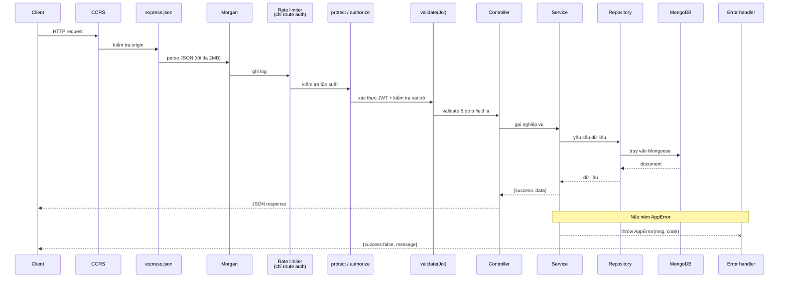

### Thứ tự middleware (khai báo trong `app.js`)
1. `cors` — chỉ chấp nhận origin trong `ALLOWED_ORIGINS`
2. `express.json({ limit: "2mb" })`
3. `morgan` — bỏ qua khi `NODE_ENV=test`
4. `/images` — phục vụ file tĩnh từ `uploads/`
5. Router theo prefix (`/api/food`, `/api/user`, …)
6. `/api/health` — kiểm tra tình trạng, trả 503 khi mất kết nối DB
7. **Error handler tập trung**
8. **404 handler** (đặt cuối cùng)

> `cleanOrderPayload` là middleware riêng chỉ gắn cho `/api/order`, dùng để chuẩn hoá `restaurantId` khi client cũ gửi lên dạng object.

---

## 7. Xác thực

### Cơ chế: **JWT, hai loại token**

| Token | Thời hạn | Payload | Lưu ở đâu |
|---|---|---|---|
| **Access token** | **30 phút** | `{ id, type: "access" }` | `localStorage` (key `token`) |
| **Refresh token** | **7 ngày** | `{ id, type: "refresh" }` | `localStorage` + **hash SHA-256 lưu trong DB** |

Refresh token **không lưu dạng thô** trong DB — chỉ lưu bản băm SHA-256 (`user.refreshToken`, có `select: false`).

### Luồng đăng ký
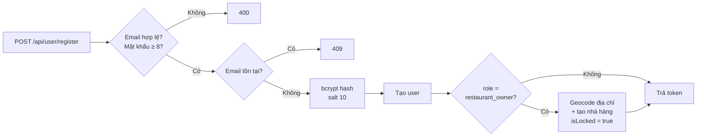

### Luồng đăng nhập
1. Tìm user theo email → không có: **401**
2. `user.locked` → **403**
3. `bcrypt.compare` sai → **401**
4. Nếu là chủ quán: nhà hàng không tồn tại → **404**; `isLocked = true` → **403** (chờ admin duyệt)
5. Phát access + refresh token, lưu hash refresh token

### Quên mật khẩu
`POST /forgot-password` → sinh token ngẫu nhiên, lưu `resetPasswordToken` + `resetPasswordExpires`, gửi email qua Nodemailer → `POST /reset-password` đặt lại mật khẩu. **Cả hai endpoint đều có rate limit.**

> ⚠️ **Chưa có 2FA.** Đây là hạng mục nằm trong [Đề xuất cải tiến](#26-đề-xuất-cải-tiến).

### Middleware `protect`
Đọc token từ `Authorization: Bearer <token>` **hoặc** header `token` (tương thích ngược), verify, **từ chối refresh token dùng để xác thực**, nạp user vào `req.user`, chặn tài khoản bị khoá và chủ quán có nhà hàng chưa duyệt.

---

## 8. Phân quyền

### Mô hình: **RBAC (theo vai trò) + kiểm tra quyền sở hữu ở tầng service**

Ba vai trò, định nghĩa trong `userModel.role`:
```
"user" | "restaurant_owner" | "admin"
```

### Hai tầng kiểm soát

**Tầng 1 — Middleware `authorize(...roles)`:** chặn theo vai trò ngay ở route.
```js
router.get("/list", protect, authorize("admin"), listUsers);
```

**Tầng 2 — Kiểm tra quyền sở hữu trong service:** vai trò đúng **chưa đủ** — phải đúng *người sở hữu tài nguyên*.
```js
// Chủ quán chỉ sửa được nhà hàng của chính mình
if (user.role !== "admin") {
  const ownsViaRestaurant = String(existing.owner?._id || existing.owner) === String(user._id);
  const ownsViaUser = String(user.restaurantId || "") === String(id);
  if (!ownsViaRestaurant && !ownsViaUser) throw new AppError("...", 403);
}
```

> ⚠️ **Bài học quan trọng:** từng có lỗ hổng do viết `if (user.role === "restaurant_owner" && khôngSởHữu) throw` — khách hàng thường **lọt thẳng qua** vì không khớp điều kiện role. Cách viết đúng là **`if (user.role !== "admin" && khôngSởHữu) throw`**: mặc định từ chối, chỉ admin được miễn.

### Bảng quyền

| Hành động | user | restaurant_owner | admin |
|---|:---:|:---:|:---:|
| Xem nhà hàng / món | ✅ | ✅ | ✅ |
| Đặt đơn | ✅ | – | – |
| Huỷ đơn của mình (khi `pending`) | ✅ | – | – |
| Xác nhận đã nhận hàng | ✅ | – | – |
| CRUD món ăn | ❌ | ✅ (quán mình) | ✅ |
| Sửa thông tin nhà hàng | ❌ | ✅ (quán mình) | ✅ |
| Đóng/mở bán | ❌ | ✅ (quán mình) | ✅ |
| Chuyển trạng thái đơn | giới hạn | ✅ (đơn của quán) | ✅ **bắt buộc nêu lý do** |
| Duyệt/khoá nhà hàng | ❌ | ❌ | ✅ |
| Khoá người dùng | ❌ | ❌ | ✅ |
| **Đặt mật khẩu cho user khác** | ❌ | ❌ | ❌ **cấm tuyệt đối** |
| Gán / đổi drone | ❌ | tự động khi giao | ✅ |
| Xem nhật ký kiểm toán | ❌ | ❌ | ✅ |

> ⚠️ **Không tự tạo vai trò mới** khi chưa được phê duyệt. Thêm vai trò kéo theo sửa `userModel` enum, mọi `authorize(...)`, và toàn bộ bảng quyền trên.

---

## 9. Cơ sở dữ liệu

**MongoDB** (NoSQL, document) qua Mongoose ODM.

### Sơ đồ quan hệ

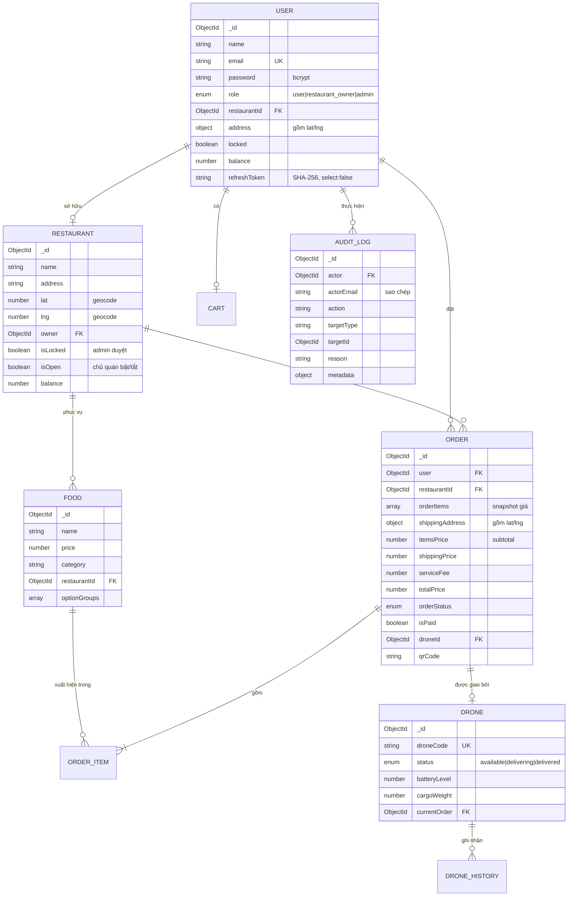

### Quyết định thiết kế quan trọng

**1. Snapshot giá trong `orderItems`.** Mỗi dòng đơn hàng lưu lại `name`, `price`, `image`, `selectedOptions` **tại thời điểm đặt**. Nhà hàng đổi giá sau đó **không làm thay đổi đơn cũ**.

**2. `itemsPrice` tách khỏi `totalPrice`.** `totalPrice` đã gồm phí giao + phí dịch vụ. Việc chia doanh thu phải dựa trên `itemsPrice` (tiền món), nếu không nhà hàng sẽ được chia cả tiền ship.

**3. Hai cờ trạng thái nhà hàng, không được nhầm lẫn:**
- `isLocked` — **admin duyệt**. Bật = chủ quán **không đăng nhập được**.
- `isOpen` — **chủ quán tự bật/tắt**. Tắt = ẩn khỏi khách và không nhận đơn, nhưng **chủ quán vẫn dùng app bình thường**.

**4. Nhật ký chỉ ghi thêm.** `auditLogSchema` cấu hình `timestamps: { createdAt: true, updatedAt: false }` và **không có endpoint sửa/xoá**.

### Index

| Collection | Index | Mục đích |
|---|---|---|
| `users` | `email` (unique) | Đăng nhập, chống trùng |
| `restaurants` | `email` (unique) | Chống trùng |
| `drones` | `droneCode` (unique) | Định danh |
| `auditlogs` | `action`, `createdAt: -1`, `(targetType, targetId)` | Lọc và phân trang nhật ký |

### Migration & transaction
- **Chưa dùng công cụ migration** (Prisma/TypeORM…). Thay đổi schema xử lý bằng **script trong `seeds/`** — ví dụ `backfillRestaurantCoords.js` để geocode bù toạ độ cho nhà hàng cũ.
- **Transaction:** chỉ dùng ở chỗ chia doanh thu (`mongoose.startSession` + `withTransaction`), **có fallback** ghi tuần tự khi MongoDB không chạy replica set (transaction yêu cầu replica set).
- **Connection pool:** dùng mặc định của Mongoose (10 kết nối), chưa cấu hình riêng.
- **Backup:** ⚠️ **chưa có chính sách sao lưu tự động** — xem [Nợ công nghệ](#25-nợ-công-nghệ).

---

## 10. Kiến trúc API

**Kiểu:** RESTful, JSON. **Chưa versioning** — mọi endpoint nằm dưới `/api/<tài nguyên>`.

### Định dạng phản hồi thống nhất

Thành công:
```json
{ "success": true, "data": { }, "message": "..." }
```
Danh sách có phân trang:
```json
{ "success": true, "data": [ ], "pagination": { "page": 1, "limit": 25, "total": 103, "totalPages": 5 } }
```
Lỗi:
```json
{ "success": false, "message": "Mô tả lỗi" }
```

### Mã trạng thái sử dụng

| Mã | Dùng khi |
|---|---|
| **200** | Thành công |
| **201** | Tạo mới thành công (`POST /api/restaurant`) |
| **400** | Dữ liệu sai (Joi), thiếu lý do bắt buộc, sai luật chuyển trạng thái |
| **401** | Chưa đăng nhập / token sai / hết hạn |
| **403** | Đã đăng nhập nhưng không đủ quyền, tài khoản bị khoá |
| **404** | Không tìm thấy tài nguyên |
| **409** | Xung đột: email trùng, nhà hàng đóng cửa, không còn drone |
| **429** | Vượt giới hạn tần suất |
| **500** | Lỗi máy chủ ngoài dự kiến |
| **503** | `/api/health` khi mất kết nối DB |

### Danh sách endpoint

| Nhóm | Endpoint | Quyền |
|---|---|---|
| **user** | `POST /register`, `/login`, `/logout`, `/forgot-password`, `/reset-password`, `/refresh-token` | Công khai (có rate limit) |
| | `GET /me`, `PUT /update-address`, `/profile`, `/change-password`, `/avatar` | Đã đăng nhập |
| | `GET /list`, `/stats`, `POST /lock`, `PUT /update-by-admin`, `DELETE /delete` | admin |
| **restaurant** | `GET /list` | Công khai (optionalAuth) |
| | `GET /:id`, `PUT /:id`, `POST /` | Đã đăng nhập / chủ quán |
| | `PATCH /:id/open-state` | chủ quán, admin |
| | `PUT /:id/lock`, `DELETE /` | admin |
| **food** | `GET /list`, `GET /:id` | Công khai |
| | `POST /add`, `/remove`, `/update` | chủ quán (món của mình), admin |
| **cart** | `GET /get`, `POST /add`, `/update-line`, `/remove-line`, `/clear` | Đã đăng nhập (`router.use(protect)`) |
| **order** | `POST /place`, `/verify`, `GET /userorders` | Đã đăng nhập |
| | `GET /list`, `POST /status` | Theo vai trò |
| | `GET /status-stats` | admin |
| **drone** | `GET /addresses/:orderId` | Chủ đơn / quán của đơn / admin |
| | `POST /scan-qr`, `/confirm-delivery` | Chủ đơn |
| | `POST /assign` | admin, chủ quán |
| | `POST /reassign` | admin |
| | `GET /`, `/:id`, `POST /create`, `PUT /:id`, `DELETE /:id`, `/cargo-weight`, `/history/*` | admin |
| **audit** | `GET /` | admin |
| **config** | `GET /fees`, `/paypal` | Công khai |
| **health** | `GET /api/health` | Công khai |

### Quy ước
- Tài nguyên dùng **danh từ số ít** (`/api/order`, `/api/restaurant`) — hơi lệch chuẩn REST (thường dùng số nhiều) nhưng **đã nhất quán toàn hệ thống**, không đổi lẻ tẻ.
- **Mọi route ghi dữ liệu đều phải có schema Joi.** Middleware `validate` dùng `stripUnknown: true` → field lạ **bị loại bỏ âm thầm**, ngăn tấn công mass-assignment.
- Field nhạy cảm (`password` trong `updateByAdminSchema`) đánh dấu `Joi.any().forbidden()` để **báo lỗi rõ ràng** thay vì im lặng bỏ qua.

---

## 11. Luồng nghiệp vụ

### 11.1 Vòng đời đơn hàng

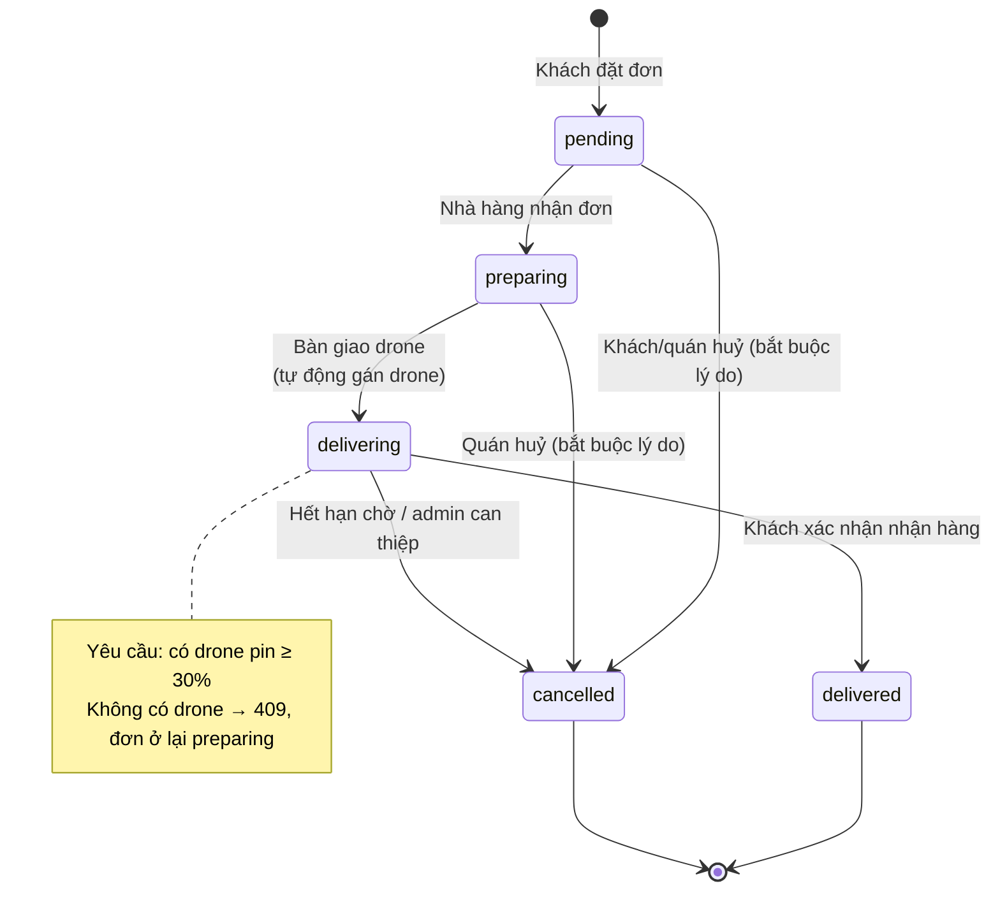

**Ai được chuyển trạng thái nào:**

| Từ → Đến | user | restaurant_owner | admin |
|---|:---:|:---:|:---:|
| pending → preparing | ❌ | ✅ | ✅ (+ lý do) |
| preparing → delivering | ❌ | ✅ | ✅ (+ lý do) |
| delivering → delivered | ✅ (đơn mình) | ❌ | ✅ (+ lý do) |
| * → cancelled | ✅ chỉ khi `pending` + lý do | ✅ + lý do | ✅ + lý do |

### 11.2 Đặt hàng (chi tiết)

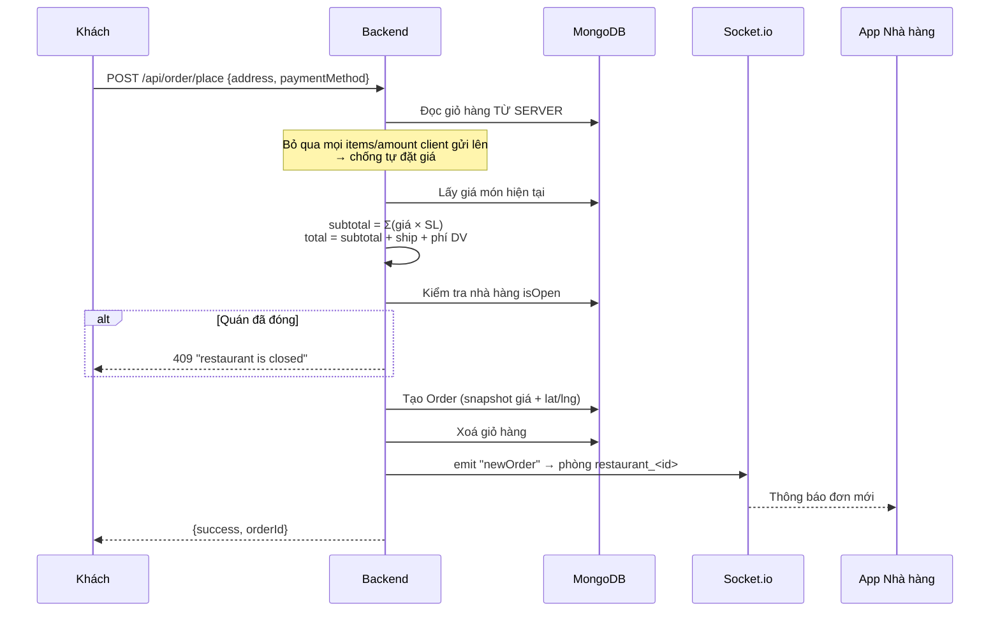

### 11.3 Giao hàng bằng drone

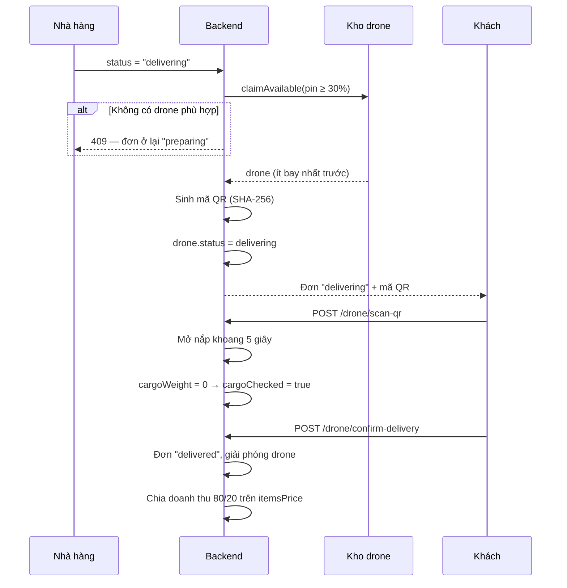

### 11.4 Chia doanh thu

Kích hoạt khi đơn chuyển sang `delivered` và đã thanh toán:

```
tiềnMón      = order.itemsPrice   (hoặc tính lại từ orderItems với đơn cũ)
phíNềnTảng   = shippingPrice + serviceFee

nhàHàng nhận = tiềnMón × 80%
admin  nhận  = tiềnMón × 20% + phíNềnTảng
```
> Phí giao hàng **hoàn toàn thuộc nền tảng**, không chia cho nhà hàng.

### 11.5 Đăng ký & duyệt nhà hàng

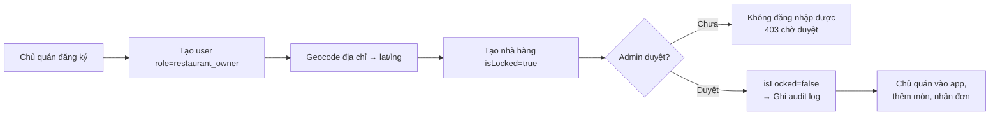

---

## 12. Đồ thị phụ thuộc

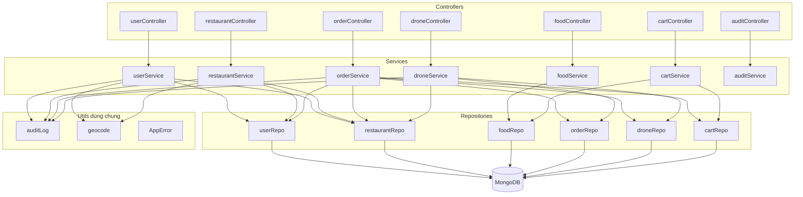

### Quy tắc phụ thuộc
1. **Một chiều:** Controller → Service → Repository. Không có chiều ngược lại.
2. **Không có phụ thuộc vòng** giữa các service. `orderService` gọi nhiều repository khác nhau, **không gọi service khác**.
3. **Utils không phụ thuộc gì** — chỉ nhận tham số và trả kết quả (trừ `auditLog` ghi DB).
4. **Import động** dùng ở 2 chỗ để tránh vòng lặp: `orderService` import `droneRepository` và `models/index.cjs` bằng `await import()`.

### Đổi chỗ nào ảnh hưởng chỗ nào

| Sửa | Ảnh hưởng |
|---|---|
| `models/*.cjs` | Toàn bộ repository + service dùng model đó |
| `middleware/auth.js` | **Mọi route** có `protect` |
| `config/fees.js` | Đặt hàng, hiển thị giá ở cả 3 frontend |
| `shared/tokens.css` | **Giao diện cả 3 app** |
| `utils/auditLog.js` | 8 điểm ghi log trong user/restaurant/order/drone service |

---

## 13. Dịch vụ bên ngoài

| Dịch vụ | Dùng để | Cấu hình | Khi lỗi thì sao |
|---|---|---|---|
| **Cloudinary** | Lưu ảnh món ăn, nhà hàng, avatar | `CLOUDINARY_CLOUD_NAME/API_KEY/API_SECRET` | Ném lỗi → request thất bại |
| **TrackAsia** | Geocoding (toạ độ ↔ địa chỉ) | `TRACKASIA_KEY` (backend), `VITE_TRACKASIA_KEY` (frontend); mặc định `public_key` | **Trả `null`, không chặn** — nhà hàng vẫn tạo được nhưng thiếu toạ độ |
| **Stripe** | Thanh toán thẻ | `STRIPE_SECRET_KEY` | Ném lỗi |
| **PayPal** | Thanh toán PayPal | `PAYPAL_CLIENT_ID` | Ném lỗi |
| **SMTP (Nodemailer)** | Email đặt lại mật khẩu | Cấu hình trong `utils/sendEmail.js` | Ném lỗi |
| **OpenStreetMap tiles** | Nền bản đồ Leaflet | Không cần key | Bản đồ trống |

### Endpoint TrackAsia (đã kiểm chứng)
```
GET https://maps.track-asia.com/api/v2/geocode/json?latlng={lat},{lng}&key={KEY}&new_admin=true
GET https://maps.track-asia.com/api/v2/place/autocomplete/json?input={q}&key={KEY}
```
Định dạng phản hồi **tương thích Google Maps**. `public_key` chỉ dùng cho môi trường dev (bị giới hạn tần suất).

### Chiến lược chịu lỗi
Chỉ **geocoding** được thiết kế "hỏng cũng không sao" (`utils/geocode.js` bắt mọi lỗi và trả `null`, timeout 8 giây). Lý do: địa chỉ thiếu toạ độ chỉ làm quán không hiện trong danh sách gần — chấp nhận được; còn chặn đăng ký chỉ vì API bản đồ lỗi thì không.

Các dịch vụ còn lại **chưa có retry/circuit breaker** — xem [Nợ công nghệ](#25-nợ-công-nghệ).

---

## 14. Cấu hình

### `backend/.env`

| Biến | Bắt buộc | Mô tả |
|---|:---:|---|
| `PORT` | – | Cổng API (mặc định 4000) |
| `MONGODB_URI` | ✅ | Chuỗi kết nối MongoDB |
| `JWT_SECRET` | ✅ | Khoá ký JWT — **thiếu là API trả 500** |
| `ALLOWED_ORIGINS` | ✅ | Danh sách origin CORS, phân tách bằng dấu phẩy |
| `FRONTEND_URL` | ✅ | Dùng cho URL callback của Stripe |
| `CLOUDINARY_*` | ✅ | 3 biến cho upload ảnh |
| `STRIPE_SECRET_KEY` | ✅ | Thanh toán thẻ |
| `PAYPAL_CLIENT_ID` | ✅ | Thanh toán PayPal |
| `TRACKASIA_KEY` | – | Mặc định `public_key` (giới hạn tần suất) |
| `NODE_ENV` | – | `test` → tắt Morgan; `production` → log dạng `combined` |

### `<app>/.env` (frontend, tiền tố `VITE_`)

| Biến | Dùng ở | Mô tả |
|---|---|---|
| `VITE_API_URL` | cả 3 app | URL backend (mặc định `http://localhost:4000`) |
| `VITE_TRACKASIA_KEY` | user | Khoá geocoding |
| `VITE_MAPBOX_API_KEY` | cả 3 | ⚠️ Có khai báo nhưng **không dùng** — xem Nợ công nghệ |

> ⚠️ Biến `VITE_*` **được nhúng thẳng vào bundle** khi build → **ai cũng đọc được**. Tuyệt đối không đặt secret ở đây.

### Chạy local vs production

| | Local (dev) | Production (Docker) |
|---|---|---|
| Backend | `npm run dev` (nodemon, tự reload) | `docker compose up -d --build backend` |
| Frontend | `npm run dev` (Vite, HMR) — cổng 5179/5184/5185 | Nginx phục vụ bản build — cổng 5173/5174/5175 |
| CORS | Phải thêm cổng dev vào `ALLOWED_ORIGINS` | Chỉ cổng production |

> ⚠️ **Container không mount source code.** Sửa file trên máy **không** ảnh hưởng container đang chạy — phải `docker compose up -d --build <service>`. Backend sẽ trả 404 cho route mới cho tới khi rebuild.

---

## 15. Ghi log

### 15.1 Log HTTP — Morgan
```js
if (process.env.NODE_ENV !== "test") {
  app.use(morgan(process.env.NODE_ENV === "production" ? "combined" : "dev"));
}
```
- `dev` — ngắn gọn, có màu, cho môi trường phát triển
- `combined` — chuẩn Apache (IP, thời gian, user-agent) cho production
- **Tắt hoàn toàn khi chạy test** để output test sạch

### 15.2 Log lỗi
Chỉ **lỗi 500** mới in stack trace ra console (trong error handler tập trung). Lỗi 4xx là lỗi nghiệp vụ bình thường, không cần log.
```js
if (statusCode === 500) console.error("Server error:", err.stack || err);
```

### 15.3 Nhật ký kiểm toán — quan trọng nhất
Khác với log kỹ thuật ở trên, **audit log ghi vào DB** và phục vụ nghiệp vụ.

Ghi qua `utils/auditLog.js`:
```js
await recordAudit({
  actor,                       // req.user
  action: "order.status_overridden_by_admin",
  targetType: "order",
  targetId: orderId,
  reason: "Khách gọi điện xác nhận",
  metadata: { from: "pending", to: "preparing" },
});
```

**8 điểm đang ghi log:** đổi trạng thái đơn, đổi drone, admin sửa user, khoá/mở user, khoá/mở nhà hàng, xoá nhà hàng, đóng/mở bán.

**Nguyên tắc thiết kế:**
- `recordAudit` **tự nuốt lỗi của chính nó** — ghi log hỏng **không được** làm chết nghiệp vụ đang chạy.
- Sao chép `actorEmail` + `actorRole` tại thời điểm ghi → nhật ký vẫn đọc được kể cả sau khi tài khoản bị xoá.
- **Chỉ ghi thêm** — không có API sửa/xoá.

### ⚠️ Nguyên tắc không được vi phạm
**Tuyệt đối không log mật khẩu, JWT, refresh token, khoá API.** `refreshToken` trong `userModel` đã đặt `select: false` để không vô tình lọt ra ngoài.

---

## 16. Xử lý lỗi

### Phân cấp lỗi

```
Error (JS gốc)
└── AppError               ← lỗi nghiệp vụ, CÓ CHỦ ĐÍCH
      • statusCode         ← mã HTTP muốn trả
      • isOperational=true ← phân biệt với lỗi lập trình
```

```js
throw new AppError("This restaurant is currently closed and is not taking orders.", 409);
```

### Error handler tập trung (cuối `app.js`)

Xử lý theo thứ tự, dịch lỗi kỹ thuật thành thông điệp cho người dùng:

| Loại lỗi | Mã trả | Xử lý |
|---|---|---|
| Joi (`err.isJoi`) | 400 | Gộp tất cả thông báo validate |
| `CastError` (ObjectId sai) | 400 | "ID không hợp lệ: ..." |
| `ValidationError` (Mongoose) | 400 | Gộp lỗi từng field |
| `code === 11000` (trùng unique) | 409 | "`<field>` đã tồn tại" |
| `entity.parse.failed` | 400 | "JSON không hợp lệ" |
| `AppError` | `statusCode` | Trả message nguyên văn |
| Còn lại | 500 | **In stack ra console**, trả message chung |

Sau đó là **404 handler** (đặt cuối cùng): `Cannot <METHOD> <path>`.

### Quy tắc viết code xử lý lỗi
1. **Dùng `AppError` cho lỗi nghiệp vụ** — đừng trả `res.status(...)` rải rác trong service.
2. **Không lộ chi tiết nội bộ.** Từng có lỗi rò rỉ `user._id`, `restaurantId`, `owner` trong thông báo 403 — đã sửa.
3. **Controller luôn `try/catch`** và trả `error.statusCode || 500`.
4. **Dọn tài nguyên khi lỗi:** controller có upload file phải `fs.unlinkSync(req.file.path)` trong `catch`.

---

## 17. Bảo mật

### 17.1 CORS
Chỉ chấp nhận origin nằm trong `ALLOWED_ORIGINS`, `credentials: true`. Socket.io dùng **cùng danh sách**.

### 17.2 Rate limiting
`express-rate-limit`: **10 request / 15 phút** cho các route nhạy cảm: `register`, `login`, `forgot-password`, `reset-password`, `refresh-token`.

### 17.3 Validate đầu vào
Mọi route ghi dữ liệu đều qua Joi với `stripUnknown: true`.

**Chống mass-assignment:** field không khai báo trong schema **bị loại bỏ**. Nhờ vậy chủ quán không thể gửi kèm `isLocked`, `balance`, `owner` để leo thang đặc quyền.

### 17.4 Chống NoSQL Injection
Mongoose ép kiểu theo schema. Joi kiểm tra kiểu trước khi tới tầng truy vấn. Không có chỗ nào nối chuỗi truy vấn thủ công.

### 17.5 Mật khẩu
- `bcrypt` salt round **10**
- Tối thiểu **8 ký tự**
- `password` mặc định **không được select** khi truy vấn
- **Admin không thể đặt mật khẩu cho user khác** (`Joi.any().forbidden()` + chốt chặn ở service) — tránh chiếm tài khoản

### 17.6 Kiểm soát quyền sở hữu (chống IDOR)
Mọi thao tác trên tài nguyên thuộc sở hữu đều kiểm tra ở **tầng service**, không chỉ dựa vào vai trò. Xem [phần 8](#8-phân-quyền).

### 17.7 Upload file
Multer giới hạn **5 MB**, chỉ chấp nhận JPEG/PNG/GIF/WebP, kiểm tra **cả phần mở rộng lẫn mimetype**.

### 17.8 Bảo vệ dữ liệu cá nhân
`GET /api/drone/addresses/:orderId` trả tên, địa chỉ, số điện thoại khách → **chỉ chủ đơn, nhà hàng xử lý đơn, hoặc admin** mới đọc được.

### ⚠️ Những gì CHƯA có

| Thiếu | Rủi ro |
|---|---|
| **Helmet** (security headers) | Thiếu `X-Frame-Options`, `X-Content-Type-Options`, HSTS… |
| **CSRF token** | Rủi ro thấp vì token nằm ở `localStorage` chứ không phải cookie |
| **Xác minh thanh toán phía server** | 🔴 **Nghiêm trọng** — `verifyOrder` tin cờ `success` do client gửi lên |
| **HTTPS** | Bắt buộc cho production; Geolocation API cũng yêu cầu HTTPS |
| **2FA** | Chưa có |

---

## 18. Hiệu suất

### Hiện trạng
- **Phân trang** ở các endpoint danh sách (`page`/`limit`), audit log giới hạn tối đa **200 bản ghi/lần**.
- **`.lean()`** dùng ở truy vấn chỉ đọc → trả object thuần, nhẹ hơn document Mongoose.
- **Cloudinary CDN** phục vụ ảnh, không đi qua backend.
- **Frontend:** `useMemo` cho tính toán khoảng cách, `IntersectionObserver` cho hiệu ứng cuộn (`Reveal`), skeleton loading.
- **Tính khoảng cách chạy ở client** (Haversine) → không tốn vòng lặp DB.

### ⚠️ Điểm nghẽn đã biết

**1. Truy vấn N+1 khi populate.** `orderRepository.findAll` populate `user`, `orderItems.product`, `restaurantId` cho **mọi** đơn. Trang admin hiện đang tải **111 đơn cùng lúc** kèm populate.

**2. Không có cache.** `GET /api/restaurant/list` và `/api/food/list` được gọi liên tục ở cả 3 app nhưng dữ liệu ít thay đổi.

**3. Frontend tải toàn bộ danh sách.** `StoreContext` tải hết `food_list` và `restaurant_list` khi khởi động, rồi lọc ở client. Ổn với 5 nhà hàng, **không ổn với 500**.

**4. Thiếu index cho truy vấn theo quan hệ.** `orders.restaurantId`, `orders.user`, `foods.restaurantId` chưa có index — đây là các trường được lọc thường xuyên nhất.

### SLO tham chiếu (chưa đo lường)
Dự án **chưa có công cụ đo (APM)**. Mục tiêu đề xuất: API đọc **p95 < 300 ms**, đặt đơn **p95 < 1 s**, uptime **99%**.

---

## 19. Khả năng mở rộng

### Hiện trạng: **một instance, chưa mở rộng ngang được**

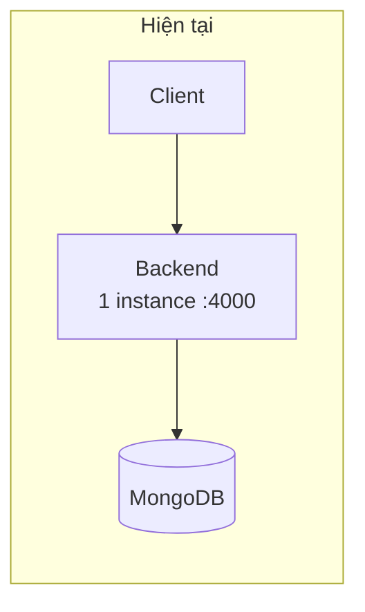

### 🚧 Rào cản khiến chưa scale ngang được

**1. Socket.io không có adapter.** Chạy nhiều instance thì chủ quán kết nối vào instance A **sẽ không nhận** được thông báo đơn phát ra từ instance B. Cần **Redis adapter**.

**2. `setTimeout` giữ trong bộ nhớ.** `droneService.scanQRCode` đặt `setTimeout` 5 giây để đóng nắp khoang, `orderService` có timeout 5 phút. **Restart tiến trình là mất sạch.** Cần chuyển sang job queue.

**3. Ảnh upload tạm nằm ở đĩa cục bộ.** `uploads/` chỉ là nơi trung chuyển trước khi đẩy lên Cloudinary — nhưng nhiều instance sẽ không thấy file của nhau nếu request bị chia tách.

**4. JWT thì OK.** Xác thực **stateless** → phần này scale ngang không vấn đề gì.

### Hướng mở rộng đề xuất

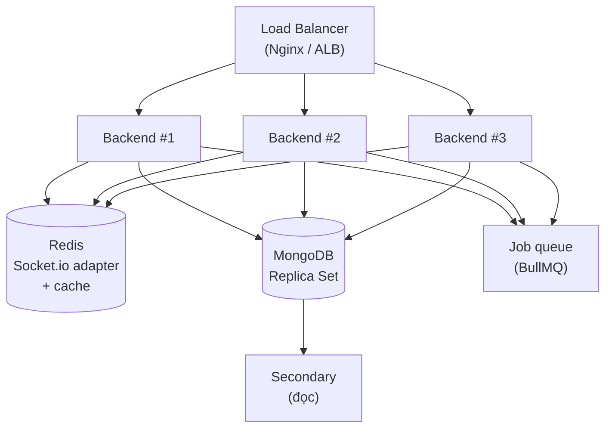

**Thứ tự ưu tiên khi cần mở rộng:**
1. **MongoDB replica set** — vừa để có transaction thật, vừa để đọc từ secondary
2. **Redis** — adapter cho Socket.io + cache danh sách nhà hàng/món
3. **Job queue** — thay `setTimeout` bằng job bền vững
4. **Nhiều instance backend** sau load balancer
5. **Sharding** — chỉ khi thực sự rất lớn; nếu tới bước này, shard theo khu vực địa lý là hợp lý nhất vì nghiệp vụ vốn đã theo bán kính

---

## 20. Triển khai

### Docker Compose — 4 service

```yaml
backend    → build ./backend         → cổng 4000
user       → build context . / user/Dockerfile      → 5173:80
admin      → build context . / admin/Dockerfile     → 5174:80
restaurant → build context . / restaurant/Dockerfile → 5175:80
```

3 frontend build với **context là thư mục gốc** để truy cập được `shared/` (design token + component dùng chung).

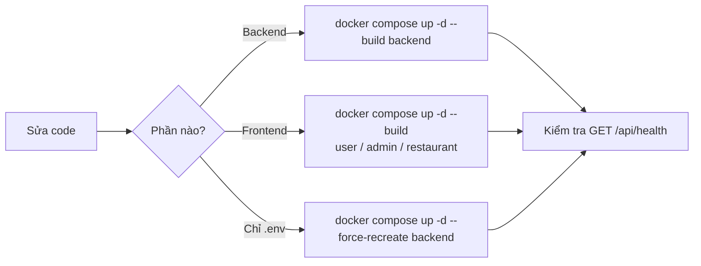

### ⚠️ Những điều phải biết khi triển khai

**1. Container KHÔNG mount source code.** Sửa file trên máy host **không** vào container. Bắt buộc rebuild. Backend sẽ **404 cho route mới** cho tới khi rebuild.

**2. Đổi `.env` cần `--force-recreate`.** `docker restart` **không** nạp lại biến môi trường.

**3. MongoDB nằm ngoài Docker Compose.** Kết nối qua `MONGODB_URI` — có thể là Atlas hoặc MongoDB trên máy host.

### Môi trường

| Môi trường | Trạng thái |
|---|---|
| **Development** | Vite dev server (5179/5184/5185) + backend Docker hoặc `npm run dev` |
| **Staging** | ❌ Chưa có |
| **Production** | Docker Compose (đã có cấu hình, **chưa có CI/CD**) |

### ⚠️ Chưa có
- **CI/CD pipeline** — chưa có GitHub Actions; build và deploy thủ công
- **Chiến lược blue-green / rolling** — `docker compose up --build` gây gián đoạn ngắn
- **HTTPS / reverse proxy** ở tầng ngoài cùng
- **Health check trong compose** — mặc dù `/api/health` đã sẵn sàng để dùng

---

## 21. Kiểm thử

### Công cụ
**Vitest** + **Supertest** (HTTP) + **mongodb-memory-server** (MongoDB thật chạy trong RAM, không cần mock).

### Cấu trúc

```
backend/tests/
├── setup.js          Khởi động MongoDB in-memory, dọn DB giữa các test
├── helpers.js        createAdmin, createRestaurantOwner, generateToken, createOrder
├── unit/             cartService, userService, authMiddleware
├── integration/      auth, cart, order (qua HTTP thật)
└── flows/            orderFlow — nghiệp vụ đầu-cuối
```

### Hiện trạng: **106 test, 7 file, tất cả pass**

```bash
npm test              # chạy một lần
npm run test:watch    # chế độ theo dõi
npm run test:coverage # báo cáo độ phủ
```

### Ba tầng kiểm thử

| Tầng | Kiểm gì | Ví dụ |
|---|---|---|
| **Unit** | Nghiệp vụ tách biệt | `cartService` gộp dòng khi thêm món trùng |
| **Integration** | Endpoint HTTP + quyền | Khách hàng gọi API admin → 403 |
| **Flow** | Nhiều bước liên hoàn | Đặt → nhận → giao → nhận hàng → chia tiền |

### Nguyên tắc viết test (đã áp dụng)

**1. Test không mock DB** — dùng MongoDB thật in-memory, nên bắt được cả lỗi schema.

**2. Khi hành vi thay đổi, sửa test cho đúng — không nới lỏng để cho qua.** Ví dụ thật trong dự án:
- Test cũ khẳng định `balance === totalPrice × 0.8` — chính là **mã hoá cái bug** chia cả tiền ship. Đã sửa test theo quy tắc đúng (chia trên `itemsPrice`).
- Test luồng giao hàng vốn pass vì **không seed drone** (lợi dụng lỗ hổng cho đơn sang `delivering` mà không có drone). Đã **seed drone thật** thay vì nới điều kiện.

**3. Test cả trường hợp bị từ chối, và kiểm tra dữ liệu KHÔNG đổi:**
```js
expect(res.status).toBe(400);
const untouched = await Order.findById(orderId);
expect(untouched.orderStatus).toBe("pending");   // phải nguyên vẹn
```

### ⚠️ Chưa có
- **Test frontend** (chưa có Vitest/RTL cho React)
- **Test E2E qua trình duyệt** (Playwright/Cypress)
- **Ngưỡng độ phủ bắt buộc** — có công cụ đo nhưng chưa đặt mục tiêu

---

## 22. Quy tắc code

### JavaScript / Node
- **ES Modules** ở backend (`"type": "module"`) — dùng `import`/`export`.
- **Ngoại lệ:** model dùng `.cjs` (CommonJS) vì Mongoose ổn định hơn với `require` trong cấu hình này. **Đừng đổi sang ESM** nếu không thật cần.
- `const` mặc định, `let` khi cần gán lại, **không dùng `var`**.
- `async/await` — không dùng `.then()` chuỗi.
- Đặt tên: `camelCase` cho biến/hàm, `PascalCase` cho component/class, `UPPER_SNAKE` cho hằng số.

### Thứ tự import (theo quy ước hiện tại)
```js
// 1. Thư viện ngoài
import express from "express";
// 2. Repository / model nội bộ
import * as orderRepo from "../repositories/orderRepository.js";
// 3. Utils
import AppError from "../utils/AppError.js";
// 4. Config
import { computeOrderTotals } from "../config/fees.js";
```

### React
- **Function component + hooks** (không dùng class).
- Mỗi component một thư mục: `Component/Component.jsx` + `Component.css`.
- **CSS class phải có tiền tố theo trang** (`.audit-page`, `.restaurants-list`) — vì CSS gom toàn cục khi build.
- Dùng `useMemo` cho tính toán nặng (khoảng cách, lọc danh sách).
- Không dùng thư viện animation — CSS transition là đủ.

### Quy ước viết chú thích
**Chú thích giải thích *tại sao*, không mô tả *cái gì*.** Code đã nói cái gì rồi.

```js
// ✅ Tốt — giải thích lý do
// Sinh URL blob mỗi lần render sẽ tạo blob mới và không bao giờ giải phóng.
// Tạo một cái cho mỗi file rồi revoke.

// ❌ Không tốt — mô tả điều hiển nhiên
// Đặt state preview
```

### Linting
ESLint có cấu hình cho cả 3 frontend (`eslint-plugin-react`, `react-hooks`, `react-refresh`). **Backend chưa có ESLint.**

---

## 23. Mẫu thiết kế

### 23.1 Layered Architecture (kiến trúc phân tầng) — xương sống
```
Controller  →  Service  →  Repository  →  Model
  (HTTP)     (nghiệp vụ)   (truy vấn)   (schema)
```
Mỗi tầng chỉ biết tầng ngay dưới. **Chỉ repository được chạm vào Mongoose.**

### 23.2 Repository Pattern
Mọi truy vấn nằm trong `repositories/`. Service không gọi trực tiếp `Model.find()`.
```js
export const findByOwner = async (ownerId) =>
  await Restaurant.findOne({ owner: ownerId });
```
**Lợi ích:** đổi CSDL chỉ cần viết lại tầng này; test dễ hơn; tránh truy vấn rải rác.

### 23.3 Middleware Chain (chuỗi trách nhiệm)
Mỗi request đi qua chuỗi middleware, mỗi cái làm đúng một việc rồi `next()`.
```js
router.put("/:id", protect, authorize("restaurant_owner", "admin"),
           uploadMiddleware.single("image"), validate(updateRestaurantSchema), updateRestaurant);
```

### 23.4 Higher-Order Function — `validate` và `authorize`
Hàm trả về middleware, cho phép cấu hình theo từng route.
```js
const authorize = (...roles) => (req, res, next) => {
  if (!req.user || !roles.includes(req.user.role))
    return res.status(403).json({ success: false, message: "..." });
  next();
};
```

### 23.5 Context Provider (frontend)
`StoreContext` (user) và `AuthContext` (restaurant/admin) cung cấp state toàn cục mà không cần Redux.

### 23.6 Custom Hooks
Logic tái dùng đóng gói thành hook: `useGeolocation`, `useNearbyRestaurants`. Nhờ vậy trang chủ và trang danh sách **dùng chung một nguồn sự thật** về "quán nào đang gần".

### 23.7 Optimistic Locking qua truy vấn có điều kiện
Gán drone dùng `findOneAndUpdate` với điều kiện nằm ngay trong filter → **hai request đồng thời không thể cùng lấy một drone**:
```js
Drone.findOneAndUpdate(
  { _id: droneId, status: "available", batteryLevel: { $gte: 30 } },
  { $set: { status: "delivering", currentOrder: orderId } }
);
```

### ⚠️ Không tự ý áp dụng pattern mới
Không thêm DI container, event sourcing, CQRS… khi chưa thống nhất. Sự nhất quán quan trọng hơn tính "hiện đại".

---

## 24. Điểm mạnh

**1. Phân tầng rõ ràng, nhất quán.** Cả 7 module đều theo đúng Controller → Service → Repository. Người mới đọc một module là hiểu được cả hệ thống.

**2. Server là nguồn sự thật về tiền.** Giá và tổng tiền luôn tính lại từ DB; mọi `items`/`amount` client gửi lên đều bị bỏ qua. Khách **không thể tự đặt giá**.

**3. Kiểm thử nghiêm túc.** 106 test dùng MongoDB thật in-memory, phủ cả unit/integration/flow. Đặc biệt: test **được sửa theo hành vi đúng**, không nới lỏng để cho qua.

**4. Validate tập trung, chống mass-assignment.** Joi + `stripUnknown` khiến field lạ bị loại bỏ mặc định — chặn cả một lớp lỗ hổng leo thang đặc quyền.

**5. Nhật ký kiểm toán.** Mọi hành động đặc quyền đều truy vết được (ai – làm gì – khi nào – lý do), có giao diện xem riêng. Đây là thứ nhiều hệ thống cùng quy mô không có.

**6. Hệ thiết kế dùng chung.** `shared/tokens.css` giúp 3 app có giao diện đồng nhất, hỗ trợ dark mode toàn hệ thống chỉ bằng biến CSS.

**7. Tính năng vị trí làm tới nơi.** Từ Geolocation API → chọn điểm trên bản đồ → lưu toạ độ vào đơn → drone bay đúng điểm đó → lọc nhà hàng theo bán kính thật. Toàn bộ chuỗi khép kín, không có khâu nào dùng dữ liệu giả.

**8. Xử lý lỗi tập trung.** Một error handler dịch mọi loại lỗi (Joi, Mongoose, trùng khoá) thành phản hồi thống nhất.

---

## 25. Nợ công nghệ

> Danh sách các vấn đề **đã biết**, xếp theo mức độ nghiêm trọng. **Đừng làm tệ thêm.**

### 🔴 Nghiêm trọng

**1. Không xác minh thanh toán phía server.**
```js
// orderService.verifyOrder — server TIN client
if (success === true || success === "true") {
  await orderRepo.updateById(orderId, { isPaid: true, paidAt: Date.now() });
}
```
Khách có thể tự gọi API đánh dấu đơn **đã thanh toán mà không trả tiền**. `placeOrder` cũng đặt `isPaid = true` chỉ vì client gửi kèm `paymentDetails`.
**Hướng sửa:** gọi `stripe.checkout.sessions.retrieve()` kiểm tra `payment_status` phía server; PayPal gọi API capture; lý tưởng nhất là dùng webhook.

### 🟠 Cao

**2. Xoá cứng nhà hàng.** `DELETE /api/restaurant` xoá vĩnh viễn. Hiện có chặn khi đã có đơn và **đã ghi audit log**, nhưng nên chuyển sang **soft-delete**.

**3. Hai tính năng admin làm dở.** `admin/src/pages/Restaurant/EditRestaurant.jsx` và `pages/Users/EditUser.jsx` đã viết xong nhưng **chưa nối vào đâu** (trang danh sách chỉ có khoá/mở, không có nút Sửa). `pages/Add/` cũng không được route.

**4. Thiếu index cho trường quan hệ.** `orders.restaurantId`, `orders.user`, `foods.restaurantId` — đây là các trường lọc nhiều nhất.

**5. Timeout giữ trong bộ nhớ.** `setTimeout` cho nắp khoang và hết hạn nhận hàng **mất khi restart tiến trình**.

### 🟡 Trung bình

**6. Dữ liệu giả hiển thị như thật.** Điểm đánh giá **4.8 hardcode ở 5 chỗ**; hero quảng cáo "500+ restaurants" trong khi hệ thống có 5. Model `reviewModel.cjs` tồn tại nhưng **không route/service nào dùng** — hệ thống đánh giá chưa hề tồn tại.

**7. `cargoWeight` ngẫu nhiên.** `Math.random() * 1500 + 500` — không liên quan gì tới món khách đặt.

**8. Không có cache.** Danh sách nhà hàng/món được gọi liên tục nhưng ít thay đổi.

**9. Frontend tải toàn bộ danh sách rồi lọc ở client.** Ổn với 5 nhà hàng, không ổn với 500.

**10. `VITE_MAPBOX_API_KEY` khai báo trong cả 3 app nhưng không dùng** — bản đồ chạy bằng Leaflet + OSM. Nên xoá.

**11. Chưa có Helmet** (security headers) và **chưa có HTTPS**.

**12. Chưa có CI/CD.**

### 🟢 Thấp

**13. Chú thích và thông báo lẫn lộn Việt–Anh** trong code backend.

**14. Backend chưa có ESLint.**

**15. Vẫn còn vài đoạn code chết** rải rác (`productModel`, `categoryModel` bị comment trong `models/index.cjs`).

**16. Số dư (`balance`) tính theo công thức cũ.** Các đơn hoàn tất **trước 2026-08-19** được chia theo công thức sai (chia cả tiền ship). Số dư hiện tại của nhà hàng/admin **không được tính lại**.

---

## 26. Đề xuất cải tiến

### Giai đoạn 1 — Bắt buộc trước khi chạy thật

| # | Việc | Vì sao |
|---|---|---|
| 1 | **Xác minh thanh toán phía server** (Stripe retrieve + webhook, PayPal capture) | Rủi ro mất tiền thật |
| 2 | **HTTPS + Helmet** | Bắt buộc cho production; Geolocation cũng cần HTTPS |
| 3 | **Soft-delete nhà hàng** | Bảo toàn dữ liệu liên quan giao dịch |
| 4 | **Thêm index** cho `orders.restaurantId`, `orders.user`, `foods.restaurantId` | Hiệu năng suy giảm nhanh theo số đơn |

### Giai đoạn 2 — Hoàn thiện sản phẩm

| # | Việc | Ghi chú |
|---|---|---|
| 5 | **Hệ thống đánh giá thật** | `reviewModel` đã có sẵn; thay điểm 4.8 hardcode |
| 6 | **Nối 2 modal admin còn dở** | Kèm giới hạn field + bắt buộc lý do + ghi audit |
| 7 | **Bỏ số liệu quảng cáo sai** ("500+ restaurants") | Ảnh hưởng độ tin cậy |
| 8 | **`cargoWeight` tính từ món thật** | Thêm trường `weight` cho món ăn |
| 9 | **Test frontend + E2E** | Vitest + RTL, Playwright |

### Giai đoạn 3 — Sẵn sàng mở rộng

| # | Việc | Ghi chú |
|---|---|---|
| 10 | **MongoDB replica set** | Có transaction thật + đọc từ secondary |
| 11 | **Redis** | Adapter Socket.io + cache danh sách |
| 12 | **Job queue (BullMQ)** | Thay `setTimeout` bằng job bền vững |
| 13 | **CI/CD** | GitHub Actions: test → build → deploy |
| 14 | **APM / giám sát** | Đo được mới tối ưu được |

### Giai đoạn 4 — Tính năng mới

- **Shipper (giao bằng người)** — đã cân nhắc và **cố ý gác lại**; sẽ cần data model riêng, luồng nghiệp vụ mới và app thứ tư.
- **2FA** cho tài khoản admin
- **Thông báo đẩy** cho khách khi đơn đổi trạng thái
- **API versioning** (`/api/v1/...`) trước khi có bên thứ ba tích hợp

### Hướng đi tổng thể
Hệ thống hiện là **một khối (monolith) phân tầng tốt**. **Không nên tách microservices** ở quy mô này — chi phí vận hành lớn hơn lợi ích. Hướng đúng là: giữ monolith, **bổ sung cache + queue + replica**, và mở rộng ngang khi cần.

---

## 27. Phụ lục

### 27.1 Thuật ngữ

| Thuật ngữ | Giải nghĩa |
|---|---|
| **Drone** | Máy bay không người lái giao hàng; có mã, pin, khoang hàng |
| **Nest** | Trạm đỗ/sạc drone (khái niệm ngành; **hệ thống hiện chưa mô hình hoá**) |
| **QR nhận hàng** | Mã sinh cho mỗi đơn; khách quét để mở khoang hàng |
| **`isLocked`** | Cờ **admin duyệt** nhà hàng. Bật = chủ quán không đăng nhập được |
| **`isOpen`** | Cờ **chủ quán tự bật/tắt** bán hàng. Tắt = ẩn khỏi khách, vẫn đăng nhập được |
| **Audit log** | Nhật ký hành động đặc quyền, chỉ ghi thêm |
| **IDOR** | Lỗ hổng truy cập tài nguyên của người khác bằng cách đổi ID |
| **Mass assignment** | Lỗ hổng gửi kèm field ngoài dự kiến để sửa dữ liệu nhạy cảm |
| **Haversine** | Công thức tính khoảng cách hai điểm trên mặt cầu |
| **BVLOS** | Bay ngoài tầm nhìn — chế độ bay drone cần giấy phép riêng |

### 27.2 Hằng số hệ thống

| Hằng số | Giá trị | Ở đâu |
|---|---|---|
| Bán kính tìm nhà hàng | **15 km** | `user/src/lib/distance.js` → `NEARBY_RADIUS_KM` |
| Pin tối thiểu để bay | **30 %** | `backend/repositories/droneRepository.js` → `MIN_BATTERY_PERCENT` |
| Phí shipper | **5.000đ/km** theo đường bộ | `backend/config/fees.js` → `SHIPPER_RATE_PER_KM` |
| Phí drone | **7.000đ/km** theo đường chim bay | `backend/config/fees.js` → `DRONE_RATE_PER_KM` |
| Phí dịch vụ | **0đ** | `backend/config/fees.js` → `SERVICE_FEE` |
| Chia doanh thu | **80 / 20** trên `itemsPrice` | `backend/services/orderService.js` |
| Hạn access token | **30 phút** | `backend/services/userService.js` |
| Hạn refresh token | **7 ngày** | `backend/services/userService.js` |
| Rate limit auth | **10 req / 15 phút** | `backend/routes/userRoute.js` |
| Giới hạn upload | **5 MB** | `backend/config/multer.js` |
| Giới hạn body JSON | **2 MB** | `backend/app.js` |
| ETA ước tính | 10 phút + 2 phút/km | `user/src/lib/distance.js` |

### 27.3 Các quyết định kiến trúc đã ghi nhận

| # | Quyết định | Lý do |
|---|---|---|
| **AD-1** | Không dùng framer-motion | Không tương thích React 18 ở dự án này; chuyển động dùng CSS thuần |
| **AD-2** | Model dùng `.cjs` giữa dự án ESM | Mongoose ổn định hơn với `require` trong cấu hình này |
| **AD-3** | Chia doanh thu trên `itemsPrice`, không phải `totalPrice` | Phí giao hàng thuộc nền tảng, không chia cho nhà hàng |
| **AD-4** | Tách `isLocked` và `isOpen` | Duyệt của admin và trạng thái bán là hai việc khác nhau; chủ quán đóng cửa vẫn phải đăng nhập được |
| **AD-5** | Kiểm tra quyền sở hữu dùng `role !== "admin"` | Viết theo `role === "restaurant_owner"` để lọt khách hàng thường qua — đã từng là lỗ hổng thật |
| **AD-6** | Audit log tự nuốt lỗi | Ghi log hỏng không được làm chết nghiệp vụ |
| **AD-7** | Không có drone phù hợp → từ chối chuyển `delivering` | Trước đây đơn vẫn sang `delivering` nhưng không drone/QR → khách không bao giờ nhận được hàng |
| **AD-8** | Đổi drone giữ nguyên mã QR | QR gắn với đơn hàng, không gắn với máy bay; khách có thể đã mở sẵn mã |
| **AD-9** | Geocoding hỏng thì bỏ qua, không chặn | Thiếu toạ độ chỉ làm quán không hiện trong danh sách gần; chặn đăng ký vì lỗi API bản đồ là quá đáng |
| **AD-10** | Gác lại tính năng shipper | Kéo theo data model, nghiệp vụ và một app thứ tư — quá lớn so với giá trị mang lại ở giai đoạn này |
| **AD-11** | Không tách microservices | Chi phí vận hành lớn hơn lợi ích ở quy mô hiện tại |

### 27.4 Câu lệnh hay dùng

```bash
# Chạy toàn hệ thống bằng Docker
docker compose up -d --build

# Dev từng app (code trên host, backend chạy Docker)
cd backend    && npm run dev
cd user       && npm run dev -- --port 5179 --strictPort
cd admin      && npm run dev -- --port 5184 --strictPort
cd restaurant && npm run dev -- --port 5185 --strictPort

# Kiểm thử
cd backend && npm test

# Sau khi sửa backend (BẮT BUỘC rebuild)
docker compose up -d --build backend

# Sau khi sửa .env
docker compose up -d --force-recreate backend

# Kiểm tra tình trạng hệ thống
curl http://localhost:4000/api/health

# Seed / backfill dữ liệu
docker exec drone-delivery-backend node seeds/seedDrones.js
docker exec drone-delivery-backend node seeds/backfillRestaurantCoords.js
```

### 27.5 Tài liệu tham khảo

- [Express](https://expressjs.com/) · [Mongoose](https://mongoosejs.com/docs/) · [Joi](https://joi.dev/api/)
- [Socket.io](https://socket.io/docs/v4/) · [Vitest](https://vitest.dev/) · [React Router v6](https://reactrouter.com/en/main)
- [TrackAsia Docs](https://docs.track-asia.com/) · [Leaflet](https://leafletjs.com/reference.html)
- [MDN — Geolocation API](https://developer.mozilla.org/en-US/docs/Web/API/Geolocation_API)
- `README.md` — hướng dẫn cài đặt nhanh

---

*Tài liệu này phải được cập nhật khi kiến trúc thay đổi. Nếu bạn sửa code khiến một phần ở đây sai, hãy sửa luôn tài liệu trong cùng lần thay đổi đó.*
